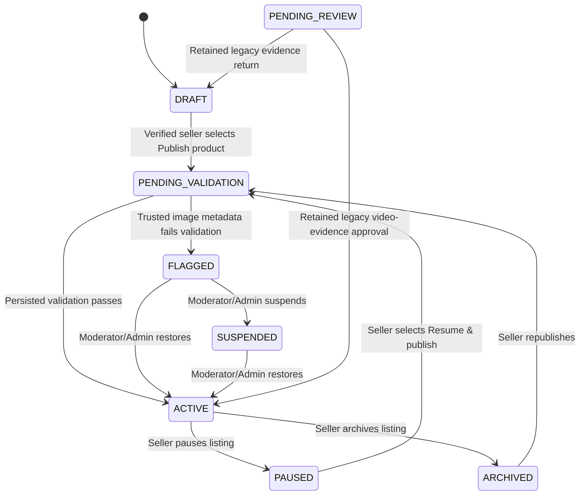

# ESUT Marketplace: Administrative Control Plane and Seller Publishing Handoff

**Prepared by:** Manus AI  
**Date:** 19 August 2026  
**Scope:** Controlled role provisioning, role-aware administrative workspaces, verified-seller product publishing, exception moderation, and regression assurance.

## Executive Summary

The marketplace no longer requires an administrator to approve every ordinary product listed by an approved seller. A seller whose identity verification is approved and whose store is active can create, edit, stock, pause, archive, and publish a product. Publication is a server-owned transaction: it validates the persisted listing, active category, active store, available inventory, and trusted image metadata. A valid product becomes **ACTIVE** immediately. A product whose persisted image records cannot be trusted becomes **FLAGGED**, stays unavailable to buyers, generates an owner notification, and enters the moderator and administrator exception workflow.

The previous evidence-video workflow has been retained for historical records already in `PENDING_REVIEW`; it is no longer the publishing gate for ordinary products. A short product video is now presented to sellers as an optional trust asset. Existing upload type and size validation remains intact.

| Area | Delivered control |
|---|---|
| Public registration | Continues to expose only Buyer, Individual Seller, and Business Vendor intents. No public administrative role option exists. |
| Controlled staff roles | Only an existing **SUPER_ADMIN** can assign or remove SUPPORT, MODERATOR, or ADMIN roles. SUPER_ADMIN roles are not mutable through the staff tool. |
| Seller publishing | Verified seller plus active store; server validates persisted product data and atomically publishes or flags it. |
| Buyer visibility | Public product and catalogue queries remain constrained to `ACTIVE` listings from active stores. Flagged, paused, suspended, draft, validation, and archived listings are not buyer-visible. |
| Moderation | Administrators and moderators retain authority to restore, suspend, or archive flagged content; actions are audited and seller-notified. |
| Auditability | Publication, flagging, staff provisioning, and moderation actions write immutable audit events. |

## Role and Workspace Model

Administrative authority is **server-enforced**, not inferred from what a client screen renders. The client only exposes navigational options after authentication; every sensitive procedure applies a role middleware check.

| Role | Marketplace capability | Administrative workspace capability |
|---|---|---|
| `CUSTOMER` | Browse, cart, checkout, account, orders, reminders, messages, reviews. | None. |
| `SELLER` | All customer capabilities plus verified, approved-store seller tools. | None, unless separately provisioned as an administrative role. |
| `SUPPORT` | Normal authenticated customer capabilities. | `/admin/operations` summary counts only. No mutations, evidence, audit trail, role management, or administrative records. |
| `MODERATOR` | Normal authenticated capabilities. | Scoped content and report moderation through moderator procedures; can act on flagged content, reports, and reviews but cannot use broad administrator management. |
| `ADMIN` | Normal authenticated capabilities. | Full marketplace control plane excluding staff-role provisioning and SUPER_ADMIN actions. |
| `SUPER_ADMIN` | Normal authenticated capabilities. | All administrator capabilities plus controlled staff provisioning at `/admin/staff`. |

> **Controlled provisioning rule:** public registration does not create administrative roles. The staff provisioning procedure accepts only an existing marketplace account ID, rejects self-changes, rejects changes to SUPER_ADMIN accounts, restricts assignable roles, and records the reason in the immutable audit log.

The administrator workspace remains distinct from buyer `/account/*` and seller `/seller/*` journeys. The core administrative navigation covers overview, analytics, users, sellers, stores, product moderation, verifications, categories, orders, reservations, offers, reports, disputes, reviews, notifications, audit log, recovery, and settings. The Super Administrator alone sees the Staff roles navigation item.

## Product Lifecycle

The `PENDING_VALIDATION` status is a short-lived, server-owned transition state. It supports auditability and prevents a competing seller action from silently overwriting a publication decision. It is not intended as a manual review queue.

## Publish Product Validation Contract

The publication procedure loads persisted marketplace records within a database transaction and validates the following server-side conditions.

| Validation | Result when not satisfied |
|---|---|
| Seller owns the listing and has an active approved store | Request is denied. |
| Listing is Draft, Paused, or Archived | Conflicting status transition is denied. |
| Title is at least three characters | Publication is rejected with actionable correction guidance. |
| Description is at least twenty characters | Publication is rejected with actionable correction guidance. |
| Price is greater than zero | Publication is rejected. |
| At least one unit is available after reservations | Publication is rejected. |
| Category is active | Publication is rejected. |
| At least one image exists | Publication is rejected. |
| Every image has persisted allowed MIME metadata and a positive size of at most 4 MB | Listing becomes `FLAGGED`; it is not buyer-visible. |

Image upload itself continues to accept only JPEG, PNG, or WebP image data with a maximum 4 MB decoded size. Migration 0015 adds nullable persisted MIME type and byte-size fields so that the subsequent publication decision validates trusted upload metadata rather than client claims. Pre-existing listing images without this metadata are conservatively routed to the exception workflow if republished.

## Seller and Moderator Experience

Sellers now see **Publish product** rather than **Submit for review**. A successful ordinary publication gives the seller the exact outcome: **“Your product is now live.”** A metadata exception returns **“Your product needs review.”** Sellers can pause a live product, archive it, edit it, update inventory, or use Resume & publish after a pause. The seller remains signed in and can continue using buyer features, cart, and checkout; no role-switching sign-out is required.

The administrator product workspace defaults to **Needs review**, which is the `FLAGGED` exception queue. Reviewers can restore an appropriately corrected listing to live status or suspend it. The retained Legacy evidence filter serves old `PENDING_REVIEW` products only; it does not impose evidence approval on newly published products.

## Administrative Metrics and Controlled Operations

The administrator command center now returns and presents real counts for total users, active buyers, active sellers, active stores, active products, orders today, orders in the last seven days, and the requires-attention total. Requires attention combines pending verifications, pending store applications, open reports, active disputes, and flagged listings. The dashboard links flagged-product counts directly to the protected moderation queue.

`/admin/operations` supplies a deliberately narrow operational summary to SUPPORT, MODERATOR, ADMIN, and SUPER_ADMIN users. It exposes workload counts only: flagged products, open reports, active disputes, and ready-for-pickup orders. It does not expose evidence files, audit history, staff roles, or administrative mutation functions.

## Security Controls Preserved

| Safeguard | Implementation status |
|---|---|
| Server-side role authorization | Enforced by protected, seller, operations, moderator, administrator, and super-administrator procedures. |
| Verified-seller publishing gate | Requires authenticated seller access, approved verification, active store, and listing ownership. |
| Buyer exposure control | Public catalogue, search, store, product, cart, and offer retrieval remain gated by `ACTIVE` listing status and active store status. |
| Upload validation | Server validates allowed image/video MIME types, encoded payload shape, decoded byte limits, and private storage keys. |
| Race protection | Publication performs an optimistic status transition into `PENDING_VALIDATION` inside its transaction and rejects competing changes. |
| Audit trail | Publication, flagging, moderation, staff provisioning, and notification-relevant transitions write audit records. |
| Super-admin self-protection | Staff provisioning cannot alter the acting super administrator or any SUPER_ADMIN account. |
| Legacy compatibility | Existing evidence-review records and procedures remain available rather than being destructively rewritten. |

## Files and Migrations Changed

| Path | Purpose |
|---|---|
| `drizzle/schema.ts` | Adds SUPPORT role, expanded listing states, and persisted listing image MIME/size metadata. |
| `drizzle/0014_low_maverick.sql` | Expands the `users.role` and `listings.status` enums safely. |
| `drizzle/0015_icy_shooting_star.sql` | Adds nullable trusted metadata columns to existing listing image records. |
| `server/_core/trpc.ts` | Adds `operationsProcedure` and `superAdminProcedure` role boundaries. |
| `server/routers.ts` | Implements validated auto-publish, flagging, staff provisioning, role-scoped operations metrics, dashboard metrics, and expanded moderation transitions. |
| `client/src/pages/SellerManagePages.tsx` | Implements Publish, Pause, Archive, and Resume & publish seller controls. |
| `client/src/pages/SellerEvidenceSubmissionPage.tsx` | Reframes the trust video as optional and removes it as the publishing gate. |
| `client/src/pages/AdminSuitePages.tsx` | Adds flagged-first moderation, restore/suspend actions, and role-aware super-admin staff navigation. |
| `client/src/pages/AdminPage.tsx` | Adds requires-attention and flagged-product command-center metrics. |
| `client/src/pages/AdminControlPlanePages.tsx` | Adds operations-summary and controlled staff-provisioning pages. |
| `client/src/App.tsx` | Registers `/admin/operations` and `/admin/staff`. |
| `server/sellerProductPublishing.test.ts` | Covers auto-publish assessment, flagging, active-only buyer policy, and publication inputs. |
| `server/authorization.test.ts` | Covers SUPPORT, operational, and SUPER_ADMIN boundaries. |
| `server/flaggedListingModeration.procedure.test.ts` | Covers protected flagged-listing restore and audit-related side effects. |

## Validation Record

| Check | Result |
|---|---|
| Database migrations | Migrations 0014 and 0015 generated, reviewed as additive, and applied successfully. |
| TypeScript | `pnpm check` passes. |
| Automated tests | `pnpm test` passes: 34 test files and 111 tests. |
| Desktop review | Seller catalogue, product moderation, admin overview, operations summary, and staff provisioning verified at 1280px. |
| Mobile review | Seller catalogue, product moderation, operations summary, and staff provisioning verified at 375px. |
| Runtime review | Development log tail after the visual pass contained normal connection/debug records and no current compile or browser runtime error. |

## Remaining Operational Notes

The two intentionally deferred production-only scheduler activations remain unchanged: product-reminder delivery and reservation-expiry processing must be enabled only after the user publishes a checkpoint and deliberately configures their protected schedules. This control-plane work neither publishes the application nor activates those schedules.

The project preserves the existing legacy evidence review rather than silently changing the state of old `PENDING_REVIEW` listings. If the team decides that all historical pending-evidence listings should be migrated, that should be a separate reviewed data-migration decision rather than an automatic code deployment side effect.

No client-side permission presentation should be treated as a security boundary. The user interface now makes permitted work easier to discover, but the source of authority remains the server-side procedure middleware and the transaction-level ownership and status checks described above.
