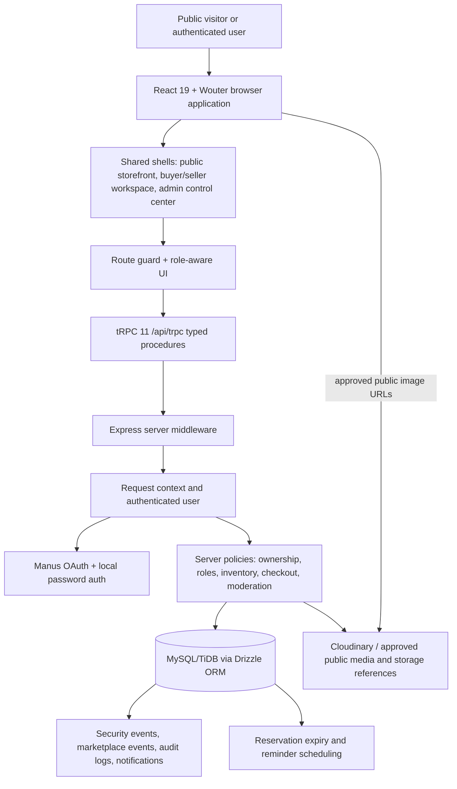
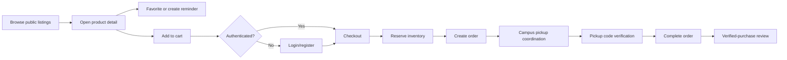

# ESUT Marketplace: Architecture, Operating Model, and Governance

**Document status:** Current implementation overview  
**Application:** ESUT Marketplace  
**Public deployment:** `https://esutshop-59wzg8bs.manus.space`  
**Prepared by:** Manus AI  
**Scope:** The running React/tRPC marketplace, its database model, user journeys, control systems, and current governance boundaries.

## Executive summary

ESUT Marketplace is a **multi-vendor university-community commerce platform**. It allows public visitors to discover approved listings and stores, authenticated buyers to save, message, order, coordinate campus pickup, and review completed purchases, authenticated sellers to apply for a store and manage approved marketplace inventory, and administrators to control users, stores, listings, categories, reports, disputes, verification, security, and operational records.

The platform is not a collection of disconnected dashboards. Its principal design is a single application with shared identity, shared database records, a typed API boundary, role-aware workspaces, and server-enforced business rules. Public discovery is intentionally separated from protected account, seller, moderator, and administrator operations. The current payment model is **cash on campus pickup**; the system does not currently represent an online card or wallet payment processor.

> The most important operating principle is that the browser is an interface, not the authority. Authorization, ownership checks, inventory rules, moderation state transitions, session revocation, and audit records are enforced on the server.

## 1. High-level architecture

The application uses a React 19 frontend, an Express server, tRPC 11 procedures, Drizzle ORM, a MySQL/TiDB-compatible database, Manus OAuth and local password authentication, Cloudinary/public media integration, Redis-backed security state where configured, and Manus-managed deployment. The same server delivers the API and the browser application.

### Main runtime responsibilities

| Layer | Responsibility | Current implementation |
|---|---|---|
| Browser application | Public storefront, buyer workspace, seller workspace, admin control center, responsive layout, loading/error/empty states | React pages and components under `client/src` |
| Route layer | Public routes, lazy-loaded protected pages, sensitive-route redirects, route titles and canonical URLs | Wouter route switch in `client/src/App.tsx` |
| API boundary | Typed queries and mutations for marketplace, auth, seller, buyer, admin, messaging, checkout, media, and security | tRPC router in `server/routers.ts` |
| Request context | Authenticated user, role, session identity, and request metadata | `server/_core/context.ts`, `server/_core/sdk.ts` |
| Authentication | Manus OAuth callback/session exchange and local password flows | `server/_core/oauth.ts`, `server/localAuth.ts`, auth procedures |
| Authorization | Public, protected, seller, administrator, moderator, and ownership checks | tRPC procedure middleware and procedure-level queries |
| Persistence | Users, sessions, listings, stores, carts, orders, reviews, reports, messages, events, media metadata, and audit records | Drizzle schema in `drizzle/schema.ts` |
| Public media | Product imagery, approved avatars, store artwork, brand artwork, derivatives and CDN delivery | Cloudinary/media asset records; legacy storage references remain represented |
| Operational controls | Security headers, non-indexing headers, asset boundaries, audit logs, reversible moderation, session revocation | Express middleware and server policy modules |

## 2. Frontend and route architecture

The public storefront uses a custom commerce-oriented shell rather than a dashboard sidebar. The homepage presents the ESUT Marketplace hero, category discovery, active listing collections, verified stores, campus-pickup messaging, and seller entry points. The Explore page provides search, category filters, sorting, loading states, empty states, and real marketplace results. Product and store pages are public detail surfaces with truthful not-found and error states.

The buyer and seller workspaces use a shared responsive workspace shell. It provides contextual navigation, account actions, visible logout access, mobile-safe layout behavior, and protected routes. The seller area adds listing creation/editing, evidence submission, inventory, seller orders, offers, reviews, analytics, store settings, and verified-seller gates. The buyer area adds orders, favorites, reminders, saved search alerts, offers, reviews, messages, notifications, profile, verification, settings, support, and Security & devices.

The administrator experience is a separate control center route family under `/admin`. It uses grouped navigation, a command-center overview, a Needs Attention queue, operational workspaces, and administrator-only controls. Administrators are controls and monitors; the application does not expose the buyer/seller purchasing and selling experience as an administrator workflow.

| Route family | Purpose | Access model |
|---|---|---|
| `/`, `/explore`, `/category/*` | Public discovery | Public |
| `/product/:slug`, `/store/:slug` | Public listing/store detail | Public; not-found states are explicit |
| `/terms`, `/privacy`, `/support`, `/contact` | Public utility and trust pages | Public |
| `/login`, `/register`, `/forgot-password`, `/reset-password`, `/verify-email` | Authentication and recovery surfaces | Public with token-specific behavior |
| `/cart` | Cart surface | Public shell with authenticated checkout boundary |
| `/checkout` | Order creation and pickup checkout | Authenticated; unauthenticated visitors redirect to `/login` |
| `/account/*` | Buyer account and security workspace | Authenticated; unauthenticated visitors redirect to `/login` |
| `/seller/*` | Seller operations | Authenticated, then seller/verification gates |
| `/moderator` | Moderation workspace | Moderator or authorized control role |
| `/admin/*` | Administration and control plane | `ADMIN` or `SUPER_ADMIN` role |

### Responsive behavior

The application treats 320–390px phones as first-class targets. Public product grids become single-column where necessary, category rows use deliberate horizontal scrolling, dialogs remain within the viewport, dashboard skeletons do not force desktop sidebars onto phones, and workspace actions stack safely. The public mobile hamburger control was removed because it caused mobile interference; the Categories control remains and automatically closes an open menu when page scrolling or an outside touch begins.

## 3. Authentication and identity flow

The platform supports two principal authentication paths.

**Manus OAuth.** A user starts at the configured OAuth portal. The provider returns to `/api/oauth/callback`; the server validates and exchanges the callback, creates or updates the user, records a tracked session with request-derived metadata, sets the secure application session, and redirects to the application. If a stale provider or bookmark places `code`, `state`, or provider error parameters on a normal SPA URL, the frontend removes those parameters from browser history without treating them as a valid session. The browser never performs the code exchange itself.

**Local password authentication.** Registration, login, password reset, and password-change flows are implemented server-side. Passwords are stored as hashes rather than plaintext. Rate-limit and lockout state is represented by authentication tables and security logic. Every password-auth session creation path now passes the live request so browser, operating-system, device, and opaque network metadata can populate Security & devices with real values.

A request reaches the tRPC context, where the session cookie/token is validated and the current user is loaded. The user identity includes a role such as `CUSTOMER`, `SELLER`, `SUPPORT`, `MODERATOR`, `ADMIN`, or `SUPER_ADMIN`. Route visibility in React is not the security boundary; protected procedures repeat the authorization check on the server.

### Session and Security & devices flow

1. Login or OAuth callback creates a row in `authSessions` with a hashed session token, device label, browser family, OS family, opaque network fingerprint, status, expiry, and activity timestamps.
2. The secure session cookie is used on subsequent requests.
3. Authenticated request handling validates the session and can refresh stale/generic device metadata from the live request.
4. The Security & devices query expires overdue active rows, returns the user’s tracked sessions, marks the current session, and returns recent `accountSecurityEvents`.
5. A user can refresh the view, revoke another device, or revoke all other tracked sessions while the current session is protected.
6. Logout revokes/clears the current session through the existing auth path and returns the user to the public marketplace.

This gives buyer and seller users a real account-security surface rather than hard-coded device cards or fabricated recent activity.

## 4. Buyer operating flow

A buyer can browse publicly without creating an account. Public discovery uses approved active listings, active categories, valid public media, and seller/store state. A buyer can open a product, inspect price, condition, location, seller verification context, availability, images, and any truthful completed-purchase reviews.

The normal buyer journey is:

The buyer cart is persisted for authenticated users. Checkout uses `orderBatches`, carts, cart items, inventory reservations, orders, and order items. Inventory reservations are time-bounded and have active, committed, released, or expired states. The system uses campus pickup and cash on pickup; it records payment state but does not currently connect to an online payment processor.

Orders transition through controlled states such as `PENDING`, `CONFIRMED`, `PROCESSING`, `READY_FOR_PICKUP`, `COMPLETED`, `CANCELLED`, and `DISPUTED`. Pickup coordination records location/instructions, proposed windows, acknowledgement, no-show exceptions, escalation, and closure. A protected pickup code is issued and verified through server-side rules with failed-attempt tracking.

Buyer communication is tied to marketplace context where applicable. Conversations can reference a listing, order, or offer. Participants are recorded explicitly, messages are stored with sender identity and timestamps, read state is tracked, and typing state expires rather than remaining permanently active.

Reviews are restricted to verified purchase eligibility. The public product view uses real buyer identity fields or approved display representations, real dates, real ratings, truthful verified-purchase status, and genuine seller responses when present. The platform must not fabricate reviews, ratings, buyers, seller responses, or testimonials.

## 5. Seller operating flow

A user begins as a customer and can submit a seller application with proposed store name, description, phone, location, and seller type. Administrators review the application. Approval can create or activate the store and enable seller operations according to the current role and verification gates.

The normal seller journey is:

1. Register or authenticate.
2. Submit seller application and, where required, verification information.
3. Wait for administrator review and approval.
4. Access seller dashboard and store management.
5. Create a listing with title, description, category, condition, price, location, fulfillment details, offers setting, and media.
6. Submit the listing through validation/moderation states.
7. Maintain inventory, respond to offers, manage seller orders, coordinate pickup, and communicate with buyers.
8. Receive truthful reviews only after completed-purchase eligibility.

A listing is not automatically public merely because a seller submits it. Listing statuses include draft, pending validation, pending review, active, paused, out of stock, flagged, suspended, reserved, sold, and archived. Product publishing policy validates required fields, category availability, image constraints, and business-state conditions. Administrators can approve, reject, pause, flag, suspend, or archive listings, with audit records and reversible moderation action support.

Seller ownership checks are enforced server-side. A seller must not be able to edit another seller’s listing, store, order, offer, evidence, or private media by changing an ID in the browser.

## 6. Administrator and moderation operating model

The administrator control center is the platform’s governance layer. It is not a second storefront. Its purpose is to control, monitor, review, manage, and audit marketplace activity.

The command center aggregates real operational signals, including unresolved reports, disputes, pending listings, seller applications, verification work, and other needs-attention items. The queue uses server-derived state, deterministic priority/age ordering, loading/error/empty states, and links to the appropriate control workspace.

| Control area | Operating responsibility |
|---|---|
| Users | View user records, suspend or restore accounts where authorized, inspect user detail, and preserve audit attribution |
| Sellers and stores | Review applications, manage store status, inspect seller context, and control store visibility |
| Listings | Approve, reject, flag, pause, suspend, archive, or restore listings through policy-bound actions |
| Categories | Create/update category metadata, availability, order, icon, and public discovery state |
| Reports | Investigate, resolve, or dismiss reports with a required note and audit record |
| Disputes | Inspect order-linked disputes and coordinate resolution |
| Reviews | Review reported or removable review content without fabricating replacement content |
| Offers and orders | Monitor marketplace negotiations, orders, pickup state, and exceptions |
| Verifications | Review identity/business evidence and preserve decision attribution without exposing private evidence publicly |
| Security | Inspect operational security state and use administrator-only security controls |
| Audit log | Review actor, action, target, metadata, and decision history |

Moderation actions are designed to be reversible where the policy permits. State changes record before/after snapshots, actor identity, timestamps, and audit metadata. This creates an accountable control path instead of silent destructive changes.

## 7. Database and domain model

The database is the source of truth for marketplace state. The major relationship groups are as follows.

| Domain | Principal tables | Meaning |
|---|---|---|
| Identity | `users`, `profiles`, `authTokens`, `authRateLimits`, `authSessions` | Identity, password/recovery state, roles, profile, rate limiting, tracked sessions |
| Security | `accountSecurityEvents`, `auditLogs`, `reversibleActions` | User security history, administrator actions, reversible state transitions |
| Seller onboarding | `sellerApplications`, `sellerApplicationAttempts`, `stores`, `verificationRequests`, verification attempts | Seller application, store identity, and verification lifecycle |
| Catalog | `categories`, `listings`, `listingImages`, `inventory`, `mediaAssets`, `listingVideoEvidence` | Category hierarchy, listing state, product media, inventory, and evidence |
| Buyer intent | `favorites`, `productReminders`, `searchAlerts`, `carts`, `cartItems` | Saved products, reminders, alerts, and shopping cart |
| Commerce | `orderBatches`, `orders`, `orderItems`, `inventoryReservations`, `orderStatusHistory`, `pickupCoordinations`, `offers` | Cart-to-order conversion, inventory locking, pickup, negotiation, and lifecycle history |
| Communication | `conversations`, `conversationParticipants`, `messages`, `conversationTypingStates` | Buyer/seller conversations, participant authorization, message history, ephemeral typing |
| Trust and engagement | reviews-related records, notifications, `marketplaceEvents` | Verified-purchase trust, in-app notifications, and user activity events |
| Operations | reports, disputes, audit and reversible-action tables, operational events | Moderation, dispute handling, and control-plane accountability |

Money-like values are stored as integer kobo values, avoiding floating-point price arithmetic. Timestamps are stored as database timestamps and displayed in the user’s local timezone. Public IDs/slugs are separate from internal numeric IDs where the domain requires safe public references.

## 8. Media and storage architecture

Public marketplace imagery is intended to use Cloudinary for approved public product images, transformed thumbnails, public artwork, logo assets, and eligible public avatars. The database stores media metadata and references such as provider, public ID, storage key, URL, purpose, entity, zone, status, dimensions, MIME type, transformation profile, and approval timestamps.

The media lifecycle is governed by status and purpose. A file can be pending, approved, rejected, archived, or deleted. Public visibility is not granted solely because a URL exists. A media asset must belong to the permitted entity, use an approved purpose/provider/zone, and satisfy the relevant moderation and visibility policy. Private evidence remains private and is not placed in public marketplace cards.

The application also retains storage-reference structures for legacy or non-Cloudinary records. Static application assets are deployed through the managed web project asset pipeline rather than being placed as large files in source directories.

## 9. Security and access-control regulation

Here, “regulation” means the platform’s implemented governance and operating controls. It should not be confused with a claim that the software alone satisfies every university policy or Nigerian legal obligation. Legal, tax, consumer-protection, privacy, and institutional policy review still require ESUT-authorized owners and qualified advisers.

### Identity and session controls

The platform uses secure session handling, server-side authentication, session expiry, revocation, tracked device metadata, login/security events, password hashing, rate limiting, lockout state, and safe logout. Sensitive account and checkout paths redirect unauthenticated visitors to login. Other sensitive route families redirect unauthenticated access to the main marketplace, while authenticated role checks remain active.

### Transport and browser protections

The server applies `X-Content-Type-Options: nosniff`, a strict referrer policy, a restrictive permissions policy, `X-Frame-Options: DENY`, a Content Security Policy, and HSTS when the request is secure or forwarded as HTTPS. API and OAuth responses are marked non-cacheable. Missing hashed asset requests return a non-HTML 404 instead of the SPA shell, preventing stale chunk requests from being misinterpreted as JavaScript.

### Crawler and privacy controls

`robots.txt` intentionally does not enumerate sensitive paths. It contains the global crawler rule and public sitemap reference. Sensitive routes receive `X-Robots-Tag: noindex, nofollow, noarchive` at the HTTP layer. This is a discovery/indexing control, not an access-control mechanism; the server’s authentication and role checks remain the actual protection.

### Marketplace trust controls

The marketplace is moderated through seller approval, listing validation, category availability, product evidence, report/dispute workflows, verification decisions, audit trails, and reversible actions. Disabled or coming-soon verticals are preserved for administrative history but are not intended to be active public inventory categories. Existing historical records should not be silently deleted solely because a category is no longer active.

### Privacy boundaries

Public visitors can see only intentionally public marketplace information. Private profile fields, session identifiers, security metadata, verification evidence, internal audit data, and buyer/seller account operations require authenticated and role-appropriate access. Public avatars require an approved public Cloudinary media record and explicit visibility state.

## 10. Notifications, reminders, and operational work

The platform has notification records for in-app delivery and supports search-alert preferences for in-app and email intent. Product reminders have scheduled timestamps and statuses such as active, triggered, cancelled, and unavailable. Reservation expiry and reminder scheduling are represented by server-side scheduled modules, with lifecycle state stored in the database rather than assumed in the browser.

Email delivery remains provider-dependent. The current architecture includes recovery and notification machinery, but ordinary-recipient live email readiness is a separately governed infrastructure track and should not be represented as complete without an authorized sending domain, DNS verification, and delivery validation.

## 11. End-to-end example: a listing becoming a completed pickup

A seller submits an application. An administrator reviews it and, if approved, the seller can create a store listing. The seller adds product information and media. The server validates the listing, checks that its category is active, validates media constraints, and places the listing into an appropriate review/publication state. An administrator can approve it; only then does public discovery include it.

A buyer opens the public product route and adds the listing to a cart. At checkout, the server verifies the buyer, listing status, available quantity, reservation state, and order idempotency. It creates or updates an order batch, places time-bounded inventory reservations, creates order and item records, and records the selected campus-pickup/cash-on-pickup method.

The seller confirms and processes the order. Pickup coordination records the meeting details and acknowledgement. The server issues a protected pickup code and tracks verification attempts. Successful handover moves the order to completed. Only after completion can review eligibility be established. A buyer can then leave a verified-purchase review, which is subject to report/removal governance and can be answered by the seller when the real response exists.

## 12. Deployment and current infrastructure boundaries

The current production path is the Manus-managed web deployment with the public `manus.space` domain. Cloudflare staging and bindings have been considered and used in prior work, but the architecture should not be described as having completed a Vercel migration, PostgreSQL migration, custom-domain cutover, or fully validated external email delivery.

| Track | Current status |
|---|---|
| Manus-managed hosting | Active and current public deployment |
| Cloudflare staging/bindings | Previously configured/considered; not the primary architecture described here |
| Cloudinary public media | Intended and integrated through media records and provider policy |
| Redis/Upstash security state | Configured where environment-backed; production behavior must remain environment-validated |
| Vercel migration | Deferred; not implemented as the current production path |
| PostgreSQL migration | Deferred; current schema is MySQL/TiDB-oriented |
| Custom domain | Deferred; current public address remains the Manus domain |
| ESUT sender domain and live recovery email | Deferred until authorized sender-domain/DNS readiness |
| Always-on/reserved hosting | Not required for the current managed autoscale architecture |

## 13. What is implemented versus what should not be assumed

The current system includes real marketplace records, role-bound protected procedures, real session/security data, server-side checkout and inventory rules, seller/admin moderation, truthful review eligibility, public/private media boundaries, responsive route shells, route-aware crawler headers, sensitive-route redirects, and regression coverage.

It should not be assumed that the current system has online payments, a custom production domain, a completed Vercel migration, a completed PostgreSQL migration, a fully validated external email sender, or a separate independently deployed admin subdomain. Those are separate authorization and infrastructure decisions.

## 14. Recommended operating cadence

The marketplace should be operated as a controlled marketplace rather than merely as a website. Administrators should review the Needs Attention queue, pending seller applications, verification requests, new listing moderation, reports, disputes, suspicious security activity, and failed pickup exceptions. Seller and buyer disputes should be resolved with notes and auditable state changes. Media should be approved before public use. Category availability should be changed through controlled policy rather than ad-hoc UI hiding.

Every release should preserve the following gates: type checking, focused procedure tests, full Vitest suite, production build, narrow-mobile verification, authenticated protected-route verification, public-route smoke testing, and a reversible checkpoint. Any data migration should be schema-first, read-only audited before mutation, and performed only with an explicit authorization boundary.

## Source references

The report is grounded in the current repository implementation:

1. [Application route map and route guards](client/src/App.tsx)
2. [Database schema and domain enums](drizzle/schema.ts)
3. [Server startup, middleware, tRPC registration, scheduling, and static delivery](server/_core/index.ts)
4. [Security headers and route-aware crawler protection](server/_core/securityHeaders.ts)
5. [Authentication SDK and request context](server/_core/sdk.ts) and [server/_core/context.ts](server/_core/context.ts)
6. [OAuth callback integration](server/_core/oauth.ts)
7. [Marketplace, buyer, seller, admin, and auth procedures](server/routers.ts)
8. [Tracked sessions and account security events](server/sessionSecurity.ts)
9. [Checkout and campus-pickup policy](server/checkoutPolicies.ts)
10. [Payment method policy](server/paymentPolicy.ts)
11. [Cloudinary and media integration](server/cloudinary.ts)
12. [Public crawler policy](client/public/robots.txt) and [public sitemap](client/public/sitemap.xml)
13. [Public homepage and hero/storefront composition](client/src/pages/Home.tsx)
14. [Buyer/seller and admin page modules](client/src/pages/AccountFeaturePages.tsx), [client/src/pages/SellerManagePages.tsx](client/src/pages/SellerManagePages.tsx), and [client/src/pages/AdminSuitePages.tsx](client/src/pages/AdminSuitePages.tsx)

> This document describes the software as implemented and tested in the current repository. It is an engineering operating model, not a legal opinion or a substitute for ESUT policy approval, privacy review, consumer-protection review, or information-security governance.
