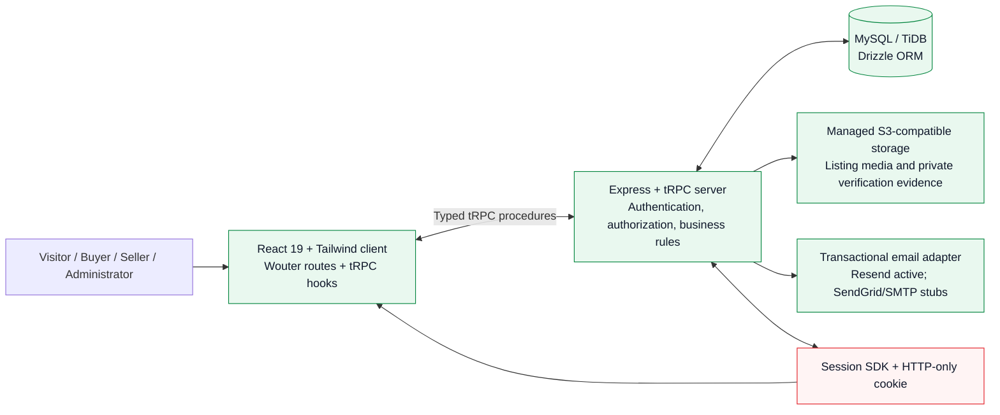
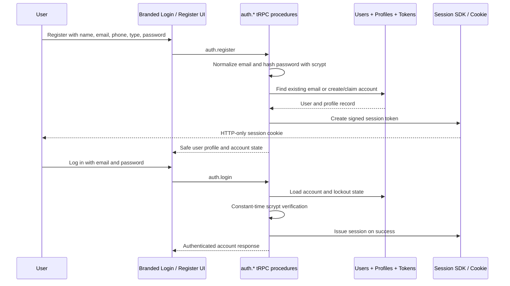
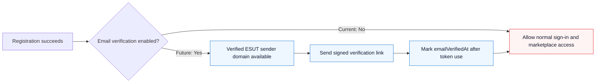
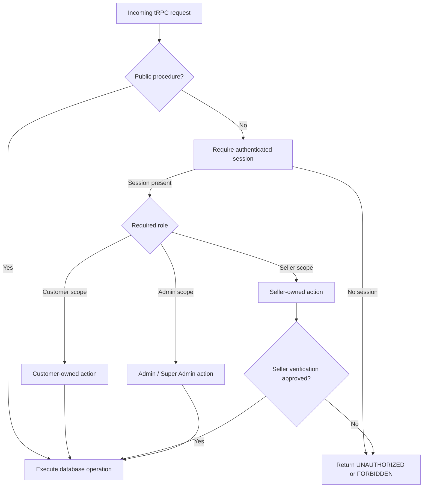
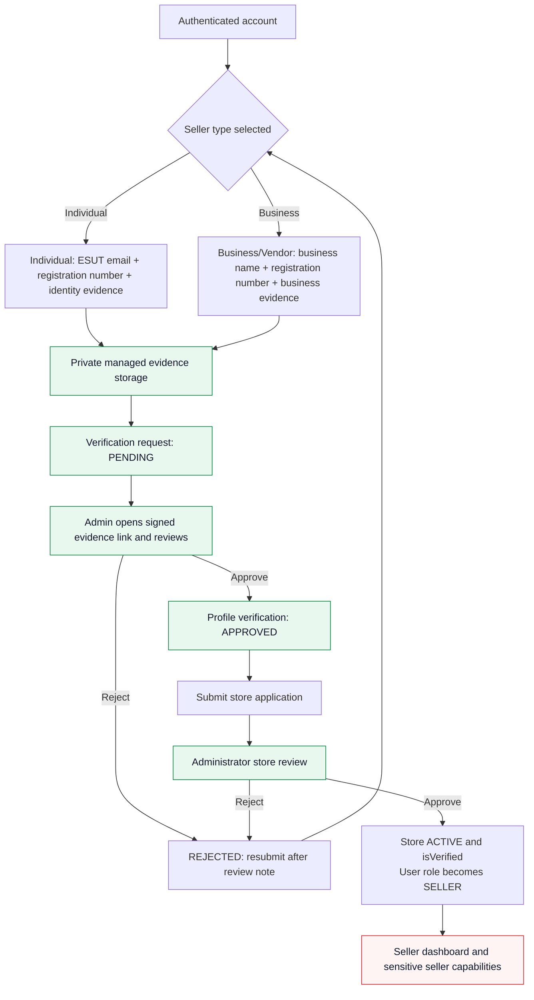
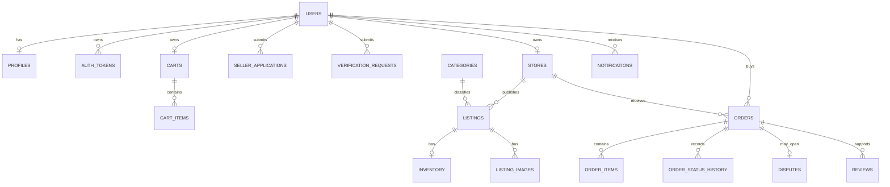
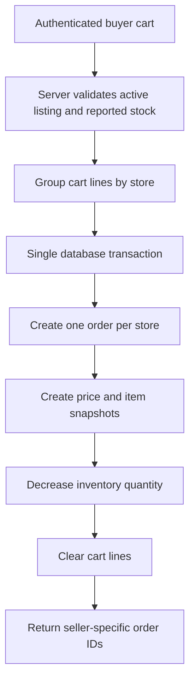
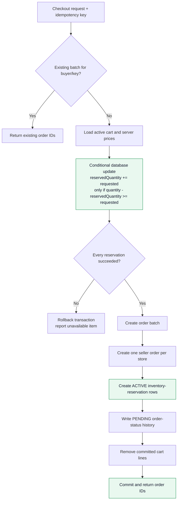
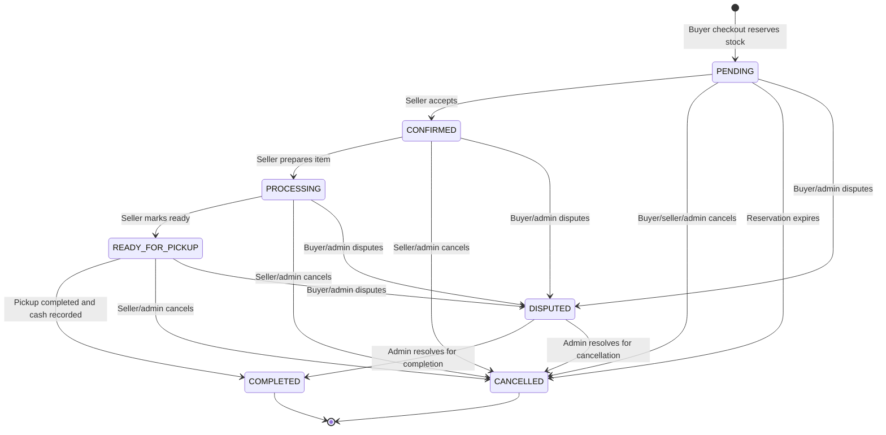
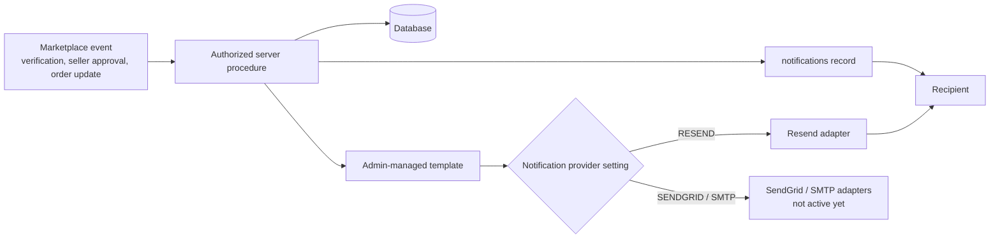

# ESUT Marketplace Architecture Report

**Prepared:** 14 August 2026  
**Purpose:** Explain the current ESUT Marketplace architecture, its security boundaries, its role-based seller trust workflow, its data domains, and the planned evolution of inventory and order management.

> **Architecture position:** ESUT Marketplace is a full-stack, database-backed marketplace application. It currently runs as a React client plus Express/tRPC server, uses a relational database through Drizzle ORM, stores private seller evidence in managed object storage, and uses a provider-oriented transactional email layer. The system is designed around server-side enforcement: user roles, seller verification, checkout calculations, and administrator review decisions are not entrusted to the browser.

## 1. Architectural Principles

The platform follows five important principles. First, the browser is a user interface rather than a policy engine. Second, server procedures own authorization, prices, stock, status transitions, and sensitive document access. Third, trust is progressive: a buyer account is simple to create, but selling unlocks only after identity or business verification and administrator approval. Fourth, relational data represents the marketplace source of truth while object storage holds file bytes. Fifth, external delivery providers are adapters; they should not be allowed to redefine marketplace workflows.

| Principle | Current implementation effect |
| --- | --- |
| **Typed client-server contract** | React calls typed tRPC procedures instead of ad hoc HTTP clients. |
| **Server-side role enforcement** | CUSTOMER, SELLER, MODERATOR, ADMIN, and SUPER_ADMIN roles are checked in middleware. |
| **Data before UI** | Catalogue, cart, orders, seller verification, and administrative review depend on database records rather than browser-only state. |
| **Trust before sensitive selling** | Seller applications require a matching approved Individual or Business verification. |
| **External-provider isolation** | Resend is active in the delivery adapter; SendGrid and SMTP are deliberately not treated as working providers until adapters are implemented. |

## 2. Current System Context



The public web application uses the same project deployment for frontend and backend. The `/api/trpc` boundary is the application contract: public catalogue routes, protected buyer routes, seller procedures, and administrator procedures are defined in the server and consumed by the client through typed hooks.

## 3. Application Route and Role Map

```mermaid
flowchart TB
    Public[Public routes]
    Account[Authenticated account routes]
    Seller[Verified seller routes]
    Admin[Administrator routes]

    Public --> Home[/ Home /]
    Public --> Explore[/explore and /category/:slug]
    Public --> Product[/product/:slug]
    Public --> Login[/login]
    Public --> Register[/register]
    Public --> Recover[/forgot-password and /reset-password]

    Account --> BuyerAccount[/account]
    Account --> Cart[/cart]
    Account --> Checkout[/checkout]
    Account --> SellStart[/sell verification onboarding]

    Seller --> SellerDash[/seller]
    Seller --> SellerOrders[Seller-owned order query]

    Admin --> AdminDash[/admin]
    Admin --> NotificationSettings[/admin/settings/notifications]
    Admin --> Evidence[Signed verification-evidence access]

    BuyerAccount -. role-aware links .-> SellerDash
    BuyerAccount -. role-aware links .-> AdminDash

    classDef public fill:#eef7ff,stroke:#1976d2,color:#0f172a;
    classDef protected fill:#fff7e6,stroke:#f5b700,color:#0f172a;
    classDef privileged fill:#e9f8ef,stroke:#00843d,color:#0f172a;
    class Home,Explore,Product,Login,Register,Recover public;
    class BuyerAccount,Cart,Checkout,SellStart protected;
    class SellerDash,SellerOrders,AdminDash,NotificationSettings,Evidence privileged;
```

The client conditionally displays role-relevant navigation, but the corresponding server procedure is the final control. A direct attempt to call an administrator or seller procedure without the required session role returns a server-side error.

## 4. Authentication and Session Architecture

### 4.1 Branded first-party password flow



The password subsystem uses a random salt and scrypt-derived password hash. Password comparison uses a constant-time method. Authentication attempts are constrained by account-level lockout and database-backed endpoint throttling. Password-recovery and email-verification tokens are opaque values; only their hashes are persisted, with a one-hour expiry and one-time consumption model.

### 4.2 Current email-verification state



Email verification is temporarily paused to avoid blocking ordinary user registration while the current sender identity is restricted. This does **not** remove seller verification; it only affects ownership verification of a general user email address. Seller verification remains mandatory before seller capabilities unlock.

## 5. Authorization Boundary



The architecture deliberately separates two seller conditions. A user must first hold a seller-capable role to access seller procedures, and sensitive seller actions must additionally pass the profile verification status check. Administrators and super administrators retain oversight access without being blocked by seller-specific verification checks.

## 6. Seller Trust and Verification Workflow



Identity or business evidence is validated for allowed MIME type, filename safety, and 5 MB maximum size before storing in managed storage. The evidence URL is not a public listing-media URL. An administrator requests a signed link only when reviewing the matching verification request.

## 7. Marketplace Data Domains



The schema is intentionally broader than the current user interface. It already accommodates messages, offers, reports, disputes, reviews, audit logs, and richer notifications, but most of those tables are not yet connected to complete procedures and screens.

## 8. Current Checkout Flow



The current implementation calculates totals and inventory decisions on the server and uses a transaction for the checkout writes. Its remaining risk is that stock is read before a simple inventory decrement; two concurrent checkouts can see the same final unit. The next architecture iteration replaces this with atomic reservations and idempotent order batches.

## 9. Planned Concurrency-Safe Checkout Evolution



The key database operation is a conditional update. It does not ask the client or a stale prior read whether stock is available; it changes `reservedQuantity` only if enough unreserved stock still exists in the same statement. The database affected-row count determines success. If any reservation fails, the transaction rolls back all earlier reservations and no order is created.

## 10. Planned Order State Machine



When a cancellation or expiry releases an order, its reservation decreases `reservedQuantity` and becomes `RELEASED` or `EXPIRED`. When pickup completes, the reservation becomes `COMMITTED`; physical inventory quantity reduces once, the reserved quantity reduces once, and the order status history records the actor and reason. Each transition is checked by a central server policy rather than a route-specific UI assumption.

## 11. Notification Architecture



The current active delivery path is Resend. Future providers are represented by settings and interfaces, but their adapters should not be marked operational until credentials, implementation, delivery tests, and failure handling exist. In-app records remain the durable product notification path; email should link a recipient back to a current authenticated view rather than carry business state itself.

## 12. Current vs Planned Capability Boundary

| Layer | Active now | Planned / incomplete |
| --- | --- | --- |
| Public marketplace | Home, search, category route, product route, cart entry, account entry | Full SEO, richer filtering, pagination metadata, dynamic promotions. |
| Buyer commerce | Authenticated cart, server totals, campus-pickup/cash-on-pickup checkout | Order history, cancellation, pickup views, reviews, disputes, messaging, offers. |
| Seller trust | Individual/business verification, private evidence, admin review, store approval | Direct uploads, automated document checks, listing/inventory management, fulfilment, analytics. |
| Administration | Verification review, seller application review, selected notification settings | User/store monitoring, listing moderation, reports, disputes, audit-log viewer, order management, KPIs. |
| Authentication | Branded password login/register, session cookies, reset/verification primitives, lockout, throttling | Verified-domain email delivery, live end-to-end verification/reset testing, stronger account-security controls. |
| Notifications | In-app notification records, selected Resend path, template configuration | General-recipient sender verification, full event coverage, tested SendGrid/SMTP adapters, notification inbox. |
| Order safety | Transactional order creation | Conditional inventory reservations, idempotency, order batch, expiry worker, full state machine. |

## 13. Operational Dependencies and Decisions

| Dependency or decision | Why it matters | Recommended action |
| --- | --- | --- |
| Verified Resend sending domain | Enables password recovery and future email verification for real users. | Verify an ESUT Marketplace domain, update sender identity, test normal-recipient delivery, then re-enable verification deliberately. |
| Checkout reservation duration | Determines when stock is held and released. | Start with 2 hours for seller confirmation and 48 hours after confirmation for pickup. |
| Scheduled reservation expiry | Prevents abandoned orders from holding stock. | Implement through the project-supported scheduled task mechanism after reservation data exists. |
| Evidence upload architecture | Reduces server-memory pressure and improves secure document handling. | Move from Base64 tRPC payloads to direct authenticated pre-signed upload. |
| Moderation policy | Needed before marketplace scale. | Define report, dispute, seller suspension, listing review, and audit-log operating procedures. |

## 14. Implementation Map

| Architectural concern | Current project location |
| --- | --- |
| Frontend routes | `client/src/App.tsx` |
| Branded authentication UI | `client/src/pages/AuthPage.tsx` and `PasswordRecoveryPage.tsx` |
| Marketplace procedures | `server/routers.ts` |
| Roles and server middleware | `server/_core/trpc.ts` |
| Session context | `server/_core/context.ts` and SDK session helper |
| Password and token primitives | `server/localAuth.ts` |
| Seller verification schema | `server/sellerVerification.ts` |
| Core relational model | `drizzle/schema.ts` |
| Managed file storage | `server/storage.ts` |
| Email provider abstraction | `server/notifications.ts` |
| Detailed product status | `ESUT_MARKETPLACE_TECHNICAL_AUDIT_2026-08-14.md` |
| Concurrency-safe order plan | `INVENTORY_AND_ORDER_MANAGEMENT_BLUEPRINT.md` |

## 15. Final Architecture Recommendation

The next implementation phase should not add isolated pages. It should close the core operational loop:

1. Introduce atomic inventory reservations and idempotent checkout.
2. Implement buyer, seller, and administrator order-management surfaces on top of an enforced state machine.
3. Add verified-seller listing and inventory operations.
4. Verify general-recipient email delivery and restore email verification/recovery workflows.
5. Build moderation and dispute operations with auditability.
6. Add end-to-end, concurrency, IDOR, and mobile/accessibility test coverage.

This sequence keeps ESUT Marketplace aligned with its central product promise: a safe university marketplace where commerce, trust, and administration remain verifiable from the server through to the user interface.

---

## Architecture Evidence

This report reflects the current `drizzle/schema.ts`, `server/routers.ts`, `server/_core/trpc.ts`, `server/localAuth.ts`, `server/notifications.ts`, `client/src/App.tsx`, the attached technical audit, and the current inventory/order-management blueprint.
