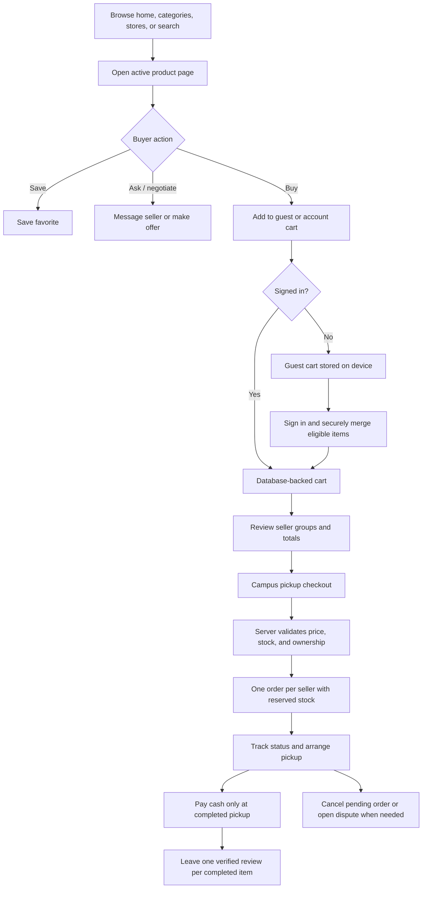
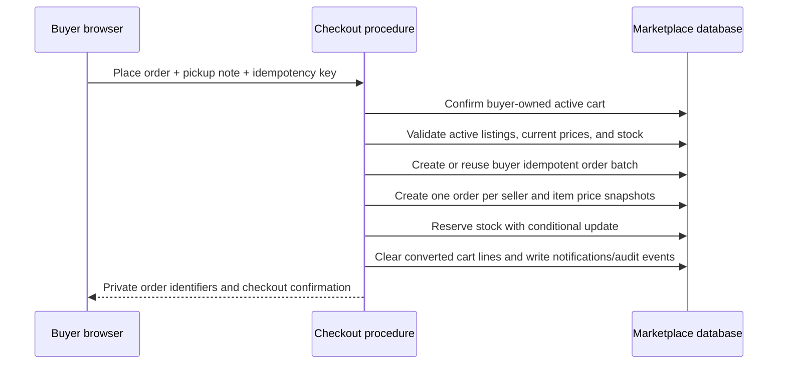

# How Buyers Operate on ESUT Marketplace

**Prepared:** 15 August 2026  
**Prepared by:** Manus AI  
**Scope:** Buyer-facing customer journey, operational rules, protection mechanisms, and current service boundaries.

> **Summary.** A buyer can discover active campus listings, inspect sellers and product details, save products, negotiate where a listing allows offers, contact the seller through a protected marketplace conversation, maintain a cart, place a cash-on-pickup campus order, track progress, cancel an unconfirmed order, request a dispute review, leave a verified-purchase review, and report unsafe content. The system is designed so that account ownership, product price, available stock, order status, and review eligibility are enforced by the server rather than trusted from the browser. [1] [2] [3]

## 1. Buyer Journey at a Glance

## 2. Browsing and Product Discovery

A person can begin browsing without an account. The home page introduces the marketplace through category, deal, trending, campus-pick, service, and verified-store areas. The catalogue supports keyword search, category navigation, price range, condition, verified-seller filtering, sorting, and pagination. Public pages return active listings and active public stores only. [1] [2]

When a buyer opens a product, they can view the title, naira price, available condition, location, gallery, description, store name, verified-seller indicator when applicable, and related items. Product information is read from the marketplace database; it is not a hardcoded demo catalogue. [1]

| Buyer task | Where it happens | What the platform shows |
| --- | --- | --- |
| Find products | Home, Explore, category pages, search | Active products, seller/store context, filters, sort order, price, condition, and location. |
| Inspect a product | Product page | Images, product description, price, location, seller profile, verification status, and related listings. |
| Inspect a seller | Store profile | Public store information, active listings, and published verified-purchase reviews. |
| Save a product | Product page or Favorites | A buyer’s saved list for later comparison. |

## 3. Creating and Protecting a Buyer Account

An account is required before checkout, offers, seller conversations, reports, disputes, notifications, reviews, and buyer dashboard access. Registration uses the branded ESUT Marketplace form, which collects the buyer’s name, email address, phone number, account type, password, and password confirmation. A buyer can show or hide password fields before submitting the form. [3]

The system hashes passwords with scrypt and a random salt. It normalizes email addresses, uses timing-safe password verification, tracks failed login attempts, and locks an account temporarily after repeated incorrect passwords. Authentication procedures are rate-limited. Browser sessions are issued through HTTP-only cookies so JavaScript does not receive the session token directly. [2]

> **Current email limitation.** Buyers may currently register and log in without completing email verification because ordinary-recipient delivery is intentionally paused while the configured test sender is restricted. Password-recovery emails are also not available for normal recipients at this time. Buyers who are already signed in can securely change their password from **Account settings** instead. [2] [5]

### 3.1 Signed-in Account Area

After login, the buyer dashboard is the private control centre for the account. It provides direct navigation to cart, orders, favorites, offers, messages, notifications, reviews, profile, account settings, safety/support, and seller onboarding where relevant. The dashboard also offers a clear logout action. [3]

| Account feature | Buyer purpose | Protection or rule |
| --- | --- | --- |
| Profile | Update phone, location, and bio | The profile update schema does not allow the buyer to self-assign a role. |
| Account settings | Change password and sign out | Current password is required; the replacement is confirmed, rehashed, audited, and the session is renewed. |
| Favorites | Compare products later | Saved records are scoped to the buyer’s account. |
| Notifications | Read marketplace updates | Notifications are returned only for the authenticated buyer. |
| Messages | Continue product conversations | Only conversation participants can read or send messages. |
| Support | See submitted reports and disputes | Only the reporting or disputing buyer can view their own records. |

## 4. Product Actions Before Checkout

### 4.1 Save to Favorites

A signed-in buyer can save or remove a listing from favorites. The system stores a unique buyer–listing relationship so a product cannot be duplicated repeatedly in the same buyer’s saved list. Favorites are private to the account that created them. [2]

### 4.2 Make an Offer

If a seller enables offers for a listing, a signed-in buyer can submit a proposed naira amount, item quantity, and optional note. The server checks that the buyer is not attempting to offer on their own product, that the listing is active, that offers are allowed, and that enough stock remains for the requested quantity. The buyer can later view the seller’s response and can cancel offers that are still actionable. [1] [2]

### 4.3 Message a Seller

Buyers can ask a product question through the listing’s **Message seller** action. The system starts or reuses a conversation for the buyer, seller, and listing. Both sides are explicitly stored as participants; a non-participant cannot retrieve the conversation or send a message into it. The interface lets buyers report a concerning message to the marketplace safety workflow. [1] [2]

### 4.4 Report a Listing, Store, Message, or Review

Signed-in buyers can report an unsafe or problematic listing from the product page, a store/review from the store experience, or a message from the conversation view. Each report includes a reason and supporting details. The marketplace creates a report record for moderator or administrator review and shows the buyer their own report history in the Support area. [1] [2]

## 5. Cart Operation

### 5.1 Guest Cart

Visitors can add products to a guest cart before creating or signing into an account. Guest cart selections are stored only on the current device. Guest checkout is not permitted; the buyer must sign in before checkout so the resulting orders, safety records, and notifications can be attached to a secure account. [1]

After sign-in, the platform attempts to merge each guest-cart line into the buyer’s account cart. It does not silently discard items. If an item is no longer active or sufficient stock is no longer available, that affected line remains in the device cart and the buyer receives an explanation. [1]

### 5.2 Account Cart

The signed-in buyer has a database-backed cart. They can increase or decrease quantities, remove lines, or move products to **Saved for later**. Saved-for-later items remain connected to the buyer’s account but are deliberately excluded from checkout until moved back to the active cart. [1] [2]

The cart displays items grouped by seller. This is important because a multi-seller basket becomes a separate order for each seller at checkout, making the pickup agreement and status of each seller’s order clear. [1] [2]

| Cart safeguard | Buyer outcome |
| --- | --- |
| Ownership scope | A buyer can update only cart lines belonging to their own cart. |
| Stock validation | Quantity changes and checkout are checked against live inventory. |
| Server price authority | Browser totals are not authoritative; checkout recomputes prices from active listings. |
| Seller grouping | Each store’s items and subtotal are shown separately. |
| Guest merge resilience | Unavailable guest items stay on the device instead of being silently lost. |
| Saved-for-later exclusion | Saved products are not included in the checkout total until reactivated. |

## 6. Checkout and Payment Operation

Checkout is deliberately constrained to the ESUT marketplace model. A signed-in buyer can select only **Campus Pickup** and **Cash on Pickup**. The buyer may add an optional pickup note, such as an intended campus area or time, then submits the order request. The interface clearly states that no online payment is processed and that payment should be made only at the agreed pickup. [4]

The checkout request includes a unique idempotency key generated by the buyer’s browser. If the buyer double-clicks or a network retry occurs, the server uses the buyer-scoped idempotency key to avoid creating duplicate batches of orders. [2] [4]

### 6.1 What Happens on the Server

The server does not trust the browser’s displayed total, stock value, seller grouping, or fulfillment data. It reads the buyer’s active cart and performs the checks inside the checkout workflow. For every seller group, the server verifies the listing is active, recomputes item prices, confirms available stock, creates an order with immutable item snapshots, and creates an inventory reservation. [2]

| Checkout rule | Meaning for the buyer |
| --- | --- |
| Campus pickup only | The buyer must arrange a safe campus collection point with the seller. |
| Cash on pickup only | No card, transfer, or fake payment-confirmation flow is presented. |
| One order per seller | A basket containing several sellers produces separate orders for clear pickup coordination. |
| Price snapshot | The order preserves the price used at placement even if a later listing price changes. |
| Inventory reservation | Stock is reserved during the open order period so it is not sold again accidentally. |
| Idempotency | Repeated submissions with the same key do not produce duplicate order batches. |

## 7. Buyer Order Management After Checkout

The buyer’s Orders page lists only orders belonging to that buyer. It displays an order identifier, store name, placed time, order total, and current status. Selecting an order shows the stored item snapshots, total, payment method, pickup workflow, and chronological status history. [6]

The buyer can follow these status changes:

| Status | Meaning to the buyer | Typical next step |
| --- | --- | --- |
| `PENDING` | Order is newly placed and stock is reserved | Wait for seller confirmation, or cancel if plans change. |
| `CONFIRMED` | Seller has acknowledged the order | Communicate with the seller if pickup details are needed. |
| `PROCESSING` | Seller is preparing the items | Monitor the activity timeline. |
| `READY_FOR_PICKUP` | Seller states the order is ready | Arrange campus pickup; pay cash at collection. |
| `COMPLETED` | Pickup is recorded complete and cash is recorded through the permitted order state | Buyer may become eligible to write a review. |
| `CANCELLED` | Order was cancelled and active reservation handling is applied | The buyer can return to shopping; stock may become available again. |
| `DISPUTED` | An issue has been opened for marketplace oversight | Await administrator resolution and use the Support area for updates. |

### 7.1 Cancellation and Disputes

A buyer may cancel their own order while its status is `PENDING`. The server enforces this status boundary rather than accepting a browser request to cancel any order at any time. When a valid cancellation occurs, reserved stock is released safely and the order activity history records the transition. [2] [6]

For an active order that needs marketplace intervention, the buyer can open a dispute from the order detail page. The buyer must provide a reason and details. The dispute is connected to the buyer’s own order and is sent to the administrator workflow; the buyer can view their dispute records in Safety and Support. [2] [6]

## 8. Reviews and Trust Contribution

Reviews are intentionally tied to completed purchases. A buyer cannot post a review merely because they viewed a product, saved it, messaged a seller, or added it to the cart. The server checks that the buyer owns a completed order containing the specified listing, and the database permits only one review per order item. [2] [5]

This policy makes review content more credible for future buyers. Seller responses and review moderation are handled within the marketplace rather than requiring buyers to depend on an external review platform. [2]

## 9. Buyer Privacy and Safety Boundaries

Buyers interact with a marketplace where not every user record is public. The system uses authenticated procedures for buyer account data, cart entries, messages, orders, notifications, favorites, reports, disputes, and reviews. A direct URL alone does not grant access to another buyer’s data. [2]

| Buyer data or action | Privacy / safety boundary |
| --- | --- |
| Cart | Restricted to the authenticated cart owner. |
| Orders | Buyer order list and details are limited to the account that placed the order. |
| Messages | Only stored conversation participants can access or send messages. |
| Seller verification evidence | Not exposed to buyers or public pages; administrators retrieve it via protected signed access. |
| Disputes and reports | Buyer sees only records they opened. |
| Reviews | Buyer can create a review only after a completed purchase; duplicate reviews are blocked. |
| Passwords | Stored as password hashes, not plaintext; direct change requires the current password. |

The buyer should still use good personal safety practice at physical pickup: communicate through the marketplace where possible, choose a visible campus location, check the item before handing over cash, and use the report/dispute tools when a listing, conversation, or order raises concern.

## 10. Current Buyer-Service Boundaries

The buyer loop is intentionally honest about current service availability:

1. **No online payment occurs.** The platform supports cash on pickup only; buyers should not treat placement as a paid transaction.
2. **Buyer checkout requires sign-in.** Guest carts help discovery, but protected order creation requires an account.
3. **Email recovery is temporarily unavailable for normal recipients.** The user can change a password while signed in, but reset-email delivery remains deferred pending an approved sending domain or provider.
4. **Seller verification improves trust but does not eliminate personal caution.** Buyers should review store information, communicate clearly, and use marketplace safety tools when needed.
5. **A dispute is an administrator-review request, not an automatic refund.** Since cash is exchanged at pickup, dispute resolution is an operational marketplace workflow rather than a card-payment reversal.

## 11. Buyer Checklist

| Stage | Recommended buyer action |
| --- | --- |
| Discover | Search, filter, read the listing carefully, and inspect the store profile. |
| Decide | Save the product, make an offer if available, or message the seller for clarification. |
| Prepare cart | Confirm quantities and ensure every ready-to-buy item is in the active cart, not saved for later. |
| Checkout | Sign in, review each seller group, confirm the total, add a helpful pickup note, and place the cash-on-pickup order. |
| Collect | Follow the seller’s order status, agree a safe campus pickup point, inspect the item, and pay cash only at collection. |
| Resolve | Cancel only while pending; otherwise open a dispute or report a safety concern with clear details. |
| Contribute | After a completed order, leave a factual verified-purchase review to help other ESUT buyers. |

## Conclusion

The buyer experience in ESUT Marketplace is designed as a complete protected commerce journey, not merely a catalogue. It begins with public discovery, converts through a controlled account and cart model, uses server-validated cash-on-pickup checkout, gives buyers private order tracking and support tools, and ends with purchase-eligible reviews and safety feedback. The key operational constraint is that pickup and payment happen in person on campus; the system’s role is to make the product, seller, price, stock, status, and record of the transaction clear and accountable. [1] [2] [4]

---

## References

[1]: ./client/src/pages/ProductPage.tsx "Buyer product discovery, guest cart, favorites, offers, messaging, and reports"
[2]: ./server/routers.ts "Server-enforced buyer ownership, cart, checkout, order, support, review, and authorization procedures"
[3]: ./client/src/pages/AccountPage.tsx "Buyer dashboard and signed-in account navigation"
[4]: ./client/src/pages/CheckoutPage.tsx "Campus-pickup and cash-on-pickup checkout experience"
[5]: ./drizzle/schema.ts "Buyer data integrity constraints, authentication, cart, order, review, support, and audit model"
[6]: ./client/src/pages/OrderPages.tsx "Buyer order list, private order detail, cancellation, dispute, and status-history interface"
