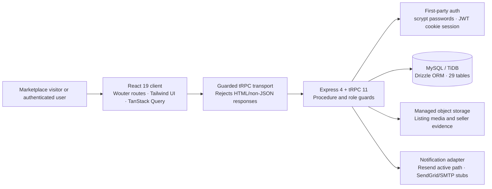
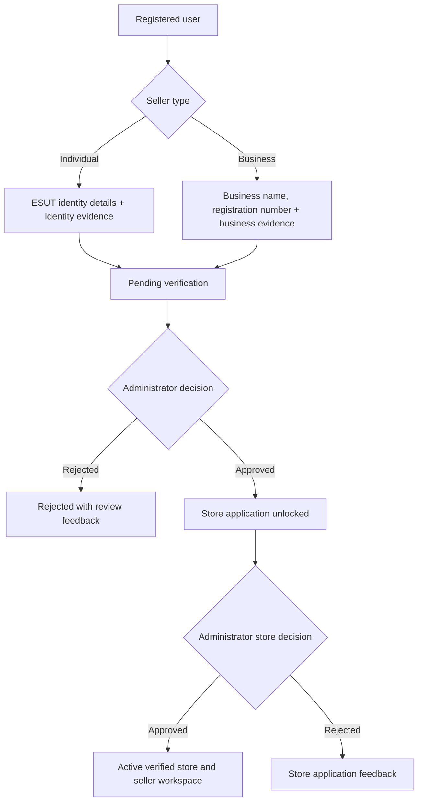

# ESUT Marketplace: Comprehensive Project Report

**Prepared:** 15 August 2026  
**Prepared by:** Manus AI  
**Project:** ESUT Marketplace  
**Assessment basis:** Current source code, database schema, application routes, automated tests, signed-in development-preview walkthrough, and recorded implementation checkpoints.

> **Executive assessment.** ESUT Marketplace is a substantial full-stack, multi-vendor Nigerian university marketplace rather than a static showcase. It implements the essential loop of trusted campus commerce: account creation, seller verification, store approval, product discovery, cart and checkout, campus-pickup order management, buyer and seller workspaces, moderation, and administrator operations. The application is **feature-complete for a controlled development preview** and has strong server-side trust controls. It should not be treated as ready for an unrestricted public launch until ordinary-recipient transactional email delivery and the remaining continuous end-to-end assurance work are completed. [1] [2] [3]

## 1. Project Purpose and Product Definition

ESUT Marketplace is designed for the Enugu State University of Science and Technology community. It serves buyers, individual sellers, business vendors, moderators, administrators, and super administrators through a single platform. Its business model deliberately restricts physical fulfillment to **Campus Pickup** and payment to **Cash on Pickup**; the system therefore does not claim online card payment or fictitious “payment successful” outcomes. [2]

The product’s differentiator is its trust model. Marketplace membership is available to normal users, but sensitive selling tools are gated behind a verification and store-approval workflow. Individual sellers provide identity and campus evidence, while business vendors provide business identity and registration evidence. Both routes require administrator review before a store can become active. [2] [4]

| Stakeholder | Principal capability | Server-enforced control |
| --- | --- | --- |
| Visitor | Browse categories, stores, listings, and product detail | Public procedures expose only active marketplace content. |
| Customer | Maintain account, cart, orders, offers, messages, reviews, reports, and disputes | Protected procedures scope records to the authenticated user. |
| Seller | Operate approved store, listings, stock, orders, offers, messages, analytics, and settings | Seller role plus verified-seller gate for sensitive operations. |
| Moderator | Review assigned safety and content queues | Moderator role is checked in server middleware. |
| Administrator / Super administrator | Review users, stores, listings, orders, verifications, reports, disputes, reviews, settings, and audit events | Administrator procedure guards and audit events protect sensitive actions. |

## 2. Solution Architecture

The application is a TypeScript monolith with a React client and an Express/tRPC server. React 19, Tailwind CSS 4, Wouter, Radix-based UI primitives, and TanStack Query form the browser application. Express 4 and tRPC 11 provide typed server procedures; Drizzle ORM maps the domain model to the configured MySQL/TiDB database. Managed object storage holds listing images and verification evidence, while the notification layer isolates transactional-email providers from marketplace workflows. [1] [2] [5]

### 2.1 Technology Baseline

| Layer | Implementation | Role in the solution |
| --- | --- | --- |
| Client | React 19, TypeScript, Vite, Wouter, Tailwind 4, Radix UI, Sonner | Responsive storefront and protected operational workspaces. |
| API | Express 4, tRPC 11, Zod, SuperJSON | Type-safe contracts, input validation, and structured procedure errors. |
| Persistence | Drizzle ORM with MySQL/TiDB | Relational marketplace data, constraints, indexes, and transactions. |
| Authentication | First-party scrypt credentials and HTTP-only session cookie | Branded registration/login with lockout and recovery-token support. |
| File handling | Managed S3-compatible storage with signed retrieval | Protected verification evidence and seller product images. |
| Notifications | Resend-backed adapter, managed templates, provider settings | In-app notifications and an isolated email-delivery boundary. |
| QA | Vitest and TypeScript checking | Contract, policy, authorization, checkout, authentication, and regression coverage. |

The compiled project exposes standard lifecycle commands for development, production build, type checking, tests, and Drizzle migration generation. The dependency manifest confirms the client/server stack and test toolchain. [1]

## 3. Implemented Product Surface

### 3.1 Public Marketplace and Buyer Experience

The public storefront provides a branded ESUT home page, search, category navigation, active-listing catalogue filters, product pages, public store profiles, and seller discovery. Storefront prices are stored as integer kobo and rendered in naira at the client layer, avoiding floating-point currency arithmetic. [2] [4]

Signed-in buyers have database-backed areas for orders, saved favorites, cart management, offers, direct participant-only messages, notifications, reviews, profile editing, seller-verification status, safety reports, disputes, and account settings. Account settings now include a secure direct password-change form with current-password verification, confirmation, independent show/hide controls, and success/error feedback. [2] [4]

### 3.2 Seller Onboarding and Operations

The seller journey starts with user classification as **Individual** or **Business/Vendor** at registration. The `/sell` onboarding sequence requests the relevant information and evidence, validates input specific to that seller type, and requires the evidence review to be approved before a store application can be submitted. Store approval activates the store and unlocks the verified seller workspace. [2] [4]

Verified sellers have routes for store configuration, products and listing images, inventory, order fulfillment, buyer offers, messages, purchase-eligible reviews, analytics, and seller settings. Ownership is enforced server-side rather than assumed from client-side route visibility. [2] [4]

### 3.3 Marketplace Operations, Moderation, and Administration

The administrator suite covers live queues and operational pages for user accounts, seller applications, stores, listings, categories, orders, offers, seller evidence/verification, reports, disputes, reviews, notifications, audit logs, and marketplace settings. The moderator workspace focuses on content and safety oversight. These screens distinguish loading, retrieval failure, empty, and success states rather than silently treating a failed API request as an empty queue. [2] [4]

Sensitive operational actions write audit records. The audit model records the actor, target, action, optional metadata, and timestamp; it is used for security-sensitive actions such as order transitions and password changes. [2] [4]

## 4. Database and Domain Model

The Drizzle schema contains **29 application tables** grouped into identity, seller trust, catalogue, transaction, communication, safety, observability, and settings domains. Unique constraints and indexes support the application’s most important ownership, lookup, idempotency, and query patterns. [4]

| Domain | Principal tables | Design purpose |
| --- | --- | --- |
| Identity and session safety | `users`, `profiles`, `authTokens`, `authRateLimits` | Account details, password state, token lifecycle, account type, seller-verification state, and throttling. |
| Seller trust | `sellerApplications`, `verificationRequests`, `stores` | Individual/business evidence, review decisions, store ownership, activation, and seller contact information. |
| Catalogue and stock | `categories`, `listings`, `listingImages`, `inventory` | Product discovery, status, pricing, media order, stock quantity, and reserved stock. |
| Checkout and orders | `carts`, `cartItems`, `orderBatches`, `orders`, `orderItems`, `inventoryReservations`, `orderStatusHistory` | Multi-seller carts, idempotent checkout batches, immutable item snapshots, reservations, and order history. |
| Buyer/seller communication | `favorites`, `offers`, `conversations`, `conversationParticipants`, `messages`, `notifications` | Saved listings, negotiation, participant-only communication, and in-app notifications. |
| Marketplace safety | `reviews`, `reports`, `disputes`, `auditLogs` | Purchase-eligible reviews, report handling, order disputes, and traceable sensitive actions. |
| Configuration | `marketplaceSettings` | Provider selection and editable managed email templates. |

The schema uses unique keys for user email, profile ownership, one active cart per user, cart line uniqueness, favorite uniqueness, store and listing slugs, order public identifiers, idempotency keys per buyer, reservation uniqueness per order/listing pair, and review eligibility per order/listing pair. It also indexes the catalogue, buyer/store order histories, user notifications, audit log targets/actors, reservations, and moderation-related state. [4]

## 5. Critical Business Workflows

### 5.1 Seller Trust Workflow

Seller evidence is type-constrained, size-constrained, filename-sanitized, stored outside the relational database, and retrieved for review through protected signed URLs. The application does not expose evidence as public catalogue media. [2] [4]

### 5.2 Cart, Checkout, Inventory, and Fulfillment

Checkout validates cart ownership, listing status, current stock, and server-side prices. It groups the buyer’s active cart by seller, creates an idempotent order batch, creates one order per store, stores order-item title/price snapshots, and reserves available inventory inside a database transaction. The application allows only **Campus Pickup** and **Cash on Pickup**. [2] [4]

The order lifecycle is explicitly modeled as `PENDING`, `CONFIRMED`, `PROCESSING`, `READY_FOR_PICKUP`, `COMPLETED`, `CANCELLED`, and `DISPUTED`. Allowed transitions are asserted by server policy. Reservation releases and commitments are conditional database updates so inventory cannot be released or committed below safe limits. [2] [4]

| Workflow safeguard | Implemented behavior |
| --- | --- |
| Price integrity | The client does not submit authoritative totals; the server calculates and records prices in kobo. |
| Duplicate protection | Buyer-scoped idempotency keys prevent a repeated checkout submission from creating duplicate batches. |
| Stock integrity | Checkout reservations use conditional updates and inventory reservation records. |
| Seller isolation | Multi-seller baskets are split into per-store orders; sellers see only their own orders. |
| Pickup/payment policy | No card gateway is presented; orders remain cash-on-pickup until a permitted lifecycle transition marks them complete. |
| Auditability | Order transition history and sensitive actions are persisted. |

## 6. Authentication, Authorization, and Application Security

### 6.1 Authentication and Session Controls

The application uses first-party credentials. Passwords are hashed with scrypt using a random 16-byte salt and verified through a timing-safe comparison. Email addresses are normalized before account lookup. Verification and recovery tokens are opaque random values; only their SHA-256 hash is persisted, and token records are single-use with one-hour expiration. [2]

Login applies an account-level lockout after repeated failed attempts. Authentication endpoints, including the newly added authenticated password-change endpoint, are also rate-limited by a database-backed per-IP/per-procedure window. A successful direct password change verifies the current credential, rejects reuse of that current password, rehashes the new password, clears outstanding password-reset tokens, records an audit log, resets stale failed-login state, and issues a fresh HTTP-only session cookie. [2] [4]

| Security concern | Implemented control |
| --- | --- |
| Credential storage | Salted scrypt password hashes; no plaintext password field is stored. |
| Password updates | Current-password verification, confirm-password validation, minimum length, fresh hash, reset-token invalidation, audit log, and renewed session. |
| Brute-force defense | Per-account failed-login lockout plus rate limiting for authentication procedures. |
| Session transport | HTTP-only cookie options supplied by the shared session helper. |
| Role authorization | `protected`, seller, moderator, administrator, and verified-seller procedure guards execute on the server. |
| IDOR resistance | Ownership is checked by buyer, seller, participant, store owner, or administrator scope before data is returned or mutated. |
| Upload security | MIME allowlists, data validation, payload-size limits, sanitized filenames, private storage keys, and signed retrieval. |
| Response safety | Unknown `/api/*` requests receive JSON fallback responses and the shared transport rejects HTML/non-JSON before typed parsing. |

### 6.2 Role and Ownership Model

The five roles are `CUSTOMER`, `SELLER`, `MODERATOR`, `ADMIN`, and `SUPER_ADMIN`. Client navigation reflects a user’s status for usability, but server procedures are the actual enforcement boundary. Administrator and super-administrator users inherit seller operational access where required, while moderator access is intentionally limited to oversight rather than seller actions. [2] [4]

## 7. Notifications and Email Delivery Status

The platform has an in-app notification system and a provider-oriented transactional-email layer. Administrators can control notification-channel configuration and customize managed templates for seller application decisions and order events. Templates use allowlisted placeholders and escape generated HTML. [5]

Resend is the active provider adapter and has been verified for the currently permitted account-owner recipient. SendGrid and SMTP are deliberately represented as secure adapter stubs rather than claimed as functioning providers. Because the active Resend test sender cannot send to arbitrary recipients, **email verification and normal-recipient password recovery remain paused**. The current interface states this honestly and does not pretend that a recovery message has been delivered to a normal marketplace email address. [5]

| Capability | Present state |
| --- | --- |
| In-app marketplace notifications | Implemented and database-backed. |
| Resend adapter | Implemented; restricted by sender-domain policy. |
| Normal-recipient verification/recovery delivery | Deferred until an authorised sending domain or provider is available. |
| SendGrid / SMTP | Future adapters only; no misleading delivery claim. |
| Administrator template management | Implemented for supported template keys. |

## 8. Quality Assurance and Evidence of Validation

The latest validation record reports successful TypeScript checking and **50 automated tests across 18 test files**. The suite covers authentication lifecycle behavior, logout, paused email flags, password primitives, authorization roles, IDOR-resistant seller inventory access, cart policies, checkout decision policies, duplicate idempotency handling, reservation conflicts, payment policy, seller-verification input validation, API JSON fallback behavior, guarded transport behavior, guest-cart behavior, and public account actions. [1] [2]

The signed-in Account settings page was also inspected after implementation of the direct password-change feature. The page displayed current-password, new-password, and confirmation fields with show/hide controls, the expected security explanation, a change-password action, and sign-out access. No real credential was entered or changed during that visual inspection. [2]

| Validation category | Current evidence |
| --- | --- |
| Static correctness | `pnpm check` completed successfully after the latest password-security change. |
| Automated tests | 50 passing tests across 18 files in the latest run. |
| Seller trust workflow | Authentic individual and business verification/application approval loops were exercised in controlled sessions. |
| UI state handling | Buyer, seller, administrator, and moderator queues were upgraded with loading, failure, empty, and success feedback. |
| Desktop/mobile/accessibility baseline | Storefront breakpoints, keyboard navigation, skip link, focus visibility, and labelled controls were reviewed. |
| API response regression | HTML response parsing is guarded at both the Express fallback and client transport layers. |

## 9. Current Limitations and Deferred Prerequisites

The following items are deliberately unresolved or require more evidence before an unrestricted production launch. They should be treated as release gates, not as hidden defects.

| Priority | Item | Current status | Required next action |
| --- | --- | --- | --- |
| High | Ordinary-recipient transactional email | Deferred by owner decision | Verify an ESUT-controlled sending domain or connect an approved provider, then test delivery and re-enable policy gates. |
| High | Live verification and recovery completion | Deferred with email delivery | Exercise successful, invalid, expired, and reused token paths with authorised real recipients. |
| High | Continuous end-to-end assurance | Partially complete | Expand repeatable browser-level checks for ownership, upload, concurrency, responsiveness, and accessibility. |
| Medium | Original development-server HTML-response incident | Guarded and unit-tested | Reproduce the historical server-disconnect condition only in a controlled development environment and retain the documented safe paths. |
| Medium | Production operations | Requires launch preparation | Establish monitoring, incident response, data-retention policy, support playbook, and a moderation service-level process. |
| Medium | Final release reconciliation | Pending | Re-review outstanding checklist items after the email and end-to-end gates close. |

## 10. Recommended Release Plan

### Controlled Preview / Pilot

The current project is suitable for a controlled preview with trusted users, staff-operated seller verification, campus pickup, cash-on-pickup, and supervised support. The system’s strongest current advantages are server-side role protection, verified seller onboarding, transaction-aware checkout, and comprehensive administrator visibility.

### Public Launch Gate

Before broad public access, the project should verify an email sending domain or approved equivalent, test verification and recovery delivery to ordinary recipients, retain password changes as an in-session fallback, and expand continuous end-to-end authorization and concurrency checks. The moderator and administrator team should also have a written workflow for reports, disputes, seller evidence handling, and account safety escalation.

### Post-Launch Evolution

After the launch gate, prioritise measurable operational maturity rather than expanding disconnected features: observability, alerting, support response times, seller quality metrics, moderation analytics, and periodic security review. Any additional payment method should be introduced only with a dedicated compliance, fraud, reconciliation, and refund design; it must not be substituted with simulated payment success.

## 11. Final Conclusion

ESUT Marketplace now represents a serious full-stack campus-commerce platform with a coherent Nigerian university-marketplace model. Its implementation goes beyond visual design: it contains real data models, protected workflows, verified seller gates, inventory reservations, multi-seller checkout, order lifecycle controls, direct user account security, operational dashboards, audit logs, and a tested authorization boundary.

The remaining work is focused and visible. Its most important external dependency is an authorised email sender; its most important internal quality objective is broader continuous end-to-end validation. Subject to closing those release gates, ESUT Marketplace has a robust foundation for a trusted, campus-focused marketplace service.

---

## References

[1]: ./package.json "Project manifest: stack, scripts, and test tooling"
[2]: ./server/routers.ts "Marketplace procedures: authentication, ownership, checkout, seller, moderator, and administrator workflows"
[3]: ./todo.md "Project delivery checklist, documented deferrals, and validation milestones"
[4]: ./drizzle/schema.ts "ESUT Marketplace relational domain schema"
[5]: ./server/notifications.ts "Transactional notification adapter and managed email-template implementation"
