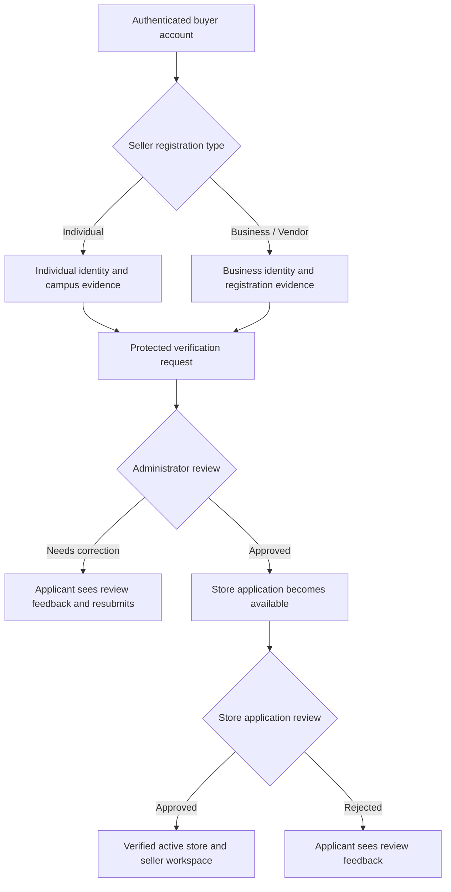
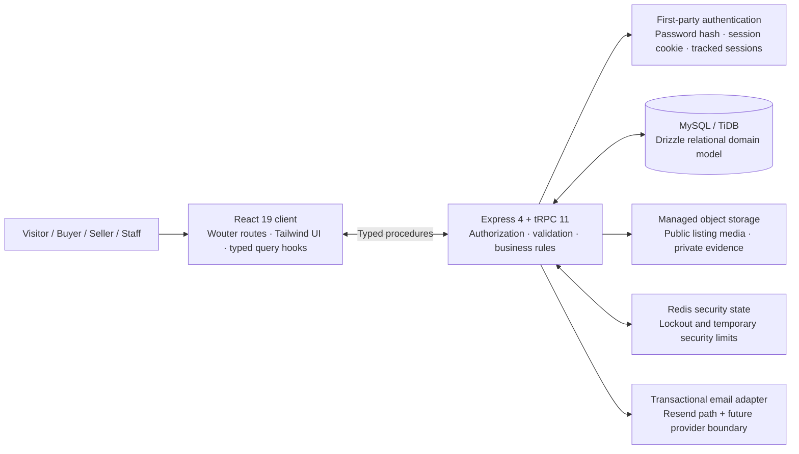

# ESUT Marketplace: Full Website Report

**Prepared:** 20 August 2026  
**Prepared by:** Manus AI  
**Website:** [esutshop-59wzg8bs.manus.space](https://esutshop-59wzg8bs.manus.space)  
**Current release:** `manus-webdev://6987c793`  
**Assessment basis:** Current application implementation, database schema, validated production-trust release, route structure, automated tests, deployment record, and prior architecture documentation.

## Executive Summary

**ESUT Marketplace is a real, database-backed multi-vendor campus-commerce platform** for the Enugu State University of Science and Technology community. It is not a static website, generic dashboard, or mock storefront. The website supports public product discovery, first-party buyer accounts, controlled individual/business seller onboarding, approved-store operations, multi-seller cart checkout, campus-pickup fulfilment, review and safety workflows, moderation, administrative oversight, auditability, and secure account management.

The platform is designed around a central operating principle: **the browser provides the experience, while the server owns the rules**. Prices, stock, seller eligibility, order states, private evidence access, admin permissions, session validity, and public content eligibility are validated on the server rather than trusted from the frontend.[1] [2]

The current release incorporates the completed Production Trust, Security, Real-Time, and UX roadmap. It includes revocable per-device sessions, Redis-backed authentication protection, immutable public order references, structured dispute/report forms with private evidence, truthful verified-purchase review presentation, opt-in avatars and review media, safe seller storefront controls, and durable refresh signals for buyer, seller, and administrator workspaces.[1]

| Area | Current status | Practical meaning |
|---|---|---|
| Public marketplace | Implemented | Visitors can browse active listings, categories, product pages, and verified stores. |
| Buyer experience | Implemented | Buyers can register, manage carts, check out, track pickup orders, communicate, review, report, and manage account security. |
| Seller operations | Implemented with verification gate | Approved sellers manage a store, listings, inventory, orders, offers, analytics, and controlled storefront presentation. |
| Trust and safety | Implemented | Seller verification, moderation, reports, disputes, private evidence, case activity, reviews, audit logs, and session security are in place. |
| Administrative operations | Implemented | Protected management of users, sellers, stores, listings, orders, reports, disputes, reviews, settings, audit records, and security health. |
| Real-time freshness | Implemented as durable polling | Active authenticated workspaces refresh from server-issued events on a 30-second interval. |
| Current launch position | Suitable for controlled public operation | Public deployment is active; formal operational readiness work remains advisable before high-volume expansion. |

## 1. Product Purpose and Marketplace Model

ESUT Marketplace exists to make campus commerce easier to discover, safer to operate, and more accountable than informal social-media selling. The product brings buyers, student entrepreneurs, individual vendors, business vendors, moderators, and administrators into one governed marketplace rather than forcing each transaction to depend on unverified personal messaging.

The marketplace currently uses a **Campus Pickup** fulfilment model and **Cash on Pickup** payment policy. This is deliberate. The system does not pretend to provide card processing, payment settlement, or automatically successful online payments where those services have not been integrated. Instead, it records an order, reserves stock safely, supports buyer-seller pickup coordination, and completes the order only through permitted server-controlled lifecycle transitions.[3]

| Marketplace participant | Primary purpose | Important access boundary |
|---|---|---|
| Visitor | Discover active products, categories, stores, and marketplace information. | Public queries expose only eligible active marketplace content. |
| Buyer / Customer | Shop, save products, create orders, arrange pickup, communicate, review, report, and manage an account. | Account-owned data is scoped to the authenticated user. |
| Applicant seller | Submit individual or business evidence and a store application. | Cannot list or manage a selling operation until verification and approval are complete. |
| Verified seller | Manage the approved store, products, stock, orders, customer communication, and analytics. | Sensitive seller routes require seller authorization and verified operational status. |
| Moderator | Triage safety reports, listings, and review concerns. | Cannot access unrelated administrative configuration or user-management controls. |
| Administrator | Operate marketplace queues, decisions, reporting, orders, records, and settings. | Server-side administrator authorization applies to every protected action. |
| Super administrator | Own the highest-risk marketplace security and staff controls. | Root-only controls require additional protection, including recent reauthentication for critical actions. |

## 2. Public Website and User Experience

The public site is branded as ESUT Marketplace and is designed as a commerce surface rather than an internal dashboard. Its home page provides prominent account entry points, category navigation, marketplace search, cart access, selling entry points, verified-seller positioning, and campus-pickup messaging. Public browsing does not require an account, while buying and account-dependent actions lead into the branded registration and login experience.

### 2.1 Public discovery

Visitors can navigate from the home page to product discovery, category results, active product details, and verified seller stores. Only active listings are exposed to normal marketplace queries. A product’s displayed availability is derived from stock records rather than a seller-entered marketing label, reducing the risk that a buyer sees an item as available when all usable units are reserved or unavailable.[2]

Public store pages now include a seller-controlled but platform-sanitized showcase area. Sellers may use a short announcement, store description, one approved accent style, and up to four featured items from their own active inventory. This gives vendors a more distinctive storefront without allowing injected HTML, styles, scripts, iframes, arbitrary links, or foreign product promotion.[1]

### 2.2 Authentication and account entry

The website has first-party branded registration and login pages. Registration distinguishes three intended paths: buyer, individual seller/vendor, and business seller/vendor. A buyer can later apply to become a seller without losing buyer functions. Likewise, approved sellers continue to shop and manage purchases through the same authenticated account rather than needing to sign out and switch identities.

Login and registration interfaces include password visibility controls and confirmation guidance. The backend normalizes contact data, validates Nigerian phone-number formats, hashes passwords using scrypt, applies account and temporary endpoint protections, and returns safe user-facing errors rather than raw schema error payloads.[2] [4]

## 3. Buyer Operations

The buyer workspace is intended to support the full pre-purchase, purchase, pickup, and post-purchase journey. Buyer data is not represented as browser-only temporary state; carts, orders, messages, reminders, reviews, reports, disputes, notifications, and account settings are backed by database records and protected procedures.[2]

| Buyer capability | How it works | Trust or usability control |
|---|---|---|
| Browse and search | Explore active products, categories, product pages, and public stores. | Inactive, paused, suspended, archived, or otherwise ineligible listings are not shown as normal purchasable products. |
| Cart management | Add eligible listings, change quantity, and maintain a database-backed cart. | Cart ownership and listing eligibility are checked on the server. |
| Checkout | Submit a buyer-scoped idempotent checkout attempt. | Server recalculates price, groups orders by store, reserves stock atomically, and prevents duplicate checkout outcomes. |
| Order management | Review buyer-owned orders using immutable public references. | Direct access is restricted to the buyer who placed the order or authorized staff. |
| Campus pickup | Follow server-controlled order status updates and pickup confirmation controls. | The completion path requires the pickup code confirmation flow. |
| Product reminders | Save reminders for later product attention. | Reminder data is owned by the buyer and does not reserve inventory. |
| Offers and messages | Communicate about an eligible listing through participant-scoped marketplace conversations. | Conversation membership is checked before data is returned or sent. |
| Reviews | Submit a rating and review only after a legitimate completed marketplace order. | One review eligibility record is tied to the completed order/listing relationship. |
| Safety reports and disputes | Use structured forms to submit reports and case evidence. | Evidence is private by default and is scoped to the relevant authorized case. |
| Account security | Review active devices, session history, account-security events, and revoke other sessions. | Session state is maintained by the server rather than the UI. |

### 3.1 Checkout, inventory, and pickup flow

The platform handles multi-seller carts by splitting a checkout into a buyer-owned order batch and one order per seller store. Each resulting order stores item-title and price snapshots at the time of purchase. This gives the buyer and the marketplace a stable historical record even if a seller later edits a listing title or price.[3]

The permitted lifecycle is controlled by the server and includes `PENDING`, `CONFIRMED`, `PROCESSING`, `READY_FOR_PICKUP`, `COMPLETED`, `CANCELLED`, and `DISPUTED`. Invalid transitions are rejected. Cancellation releases eligible reservations safely; completion commits inventory with conditional updates so stock cannot be decremented below safe levels.[3]

## 4. Seller Onboarding and Operations

Selling is intentionally more controlled than ordinary buyer registration. This protects buyers from unverified vendors and protects the campus marketplace from immediate misuse of listing, inventory, and customer-management tools.

### 4.1 Individual and business verification

An applicant selects the appropriate seller category—**Individual** or **Business/Vendor**—and completes the corresponding verification path. Individual sellers provide identity and campus-related evidence. Business vendors provide business identity and registration information. Both paths require protected evidence upload and staff review before store approval can unlock selling tools.[2]

Seller evidence remains private. The application validates file type, size, and file naming before storage. Evidence is not exposed as catalogue media and is accessed through authorized signed retrieval for the relevant review process.[2]

### 4.2 Verified seller workspace

Once approved, a seller can manage an active store without losing buyer capabilities. The seller workspace provides store profile controls, public storefront configuration, product creation and editing, listing images, stock management, order operations, offer handling, seller messaging, reviews, performance analytics, and seller settings.

| Seller function | Operational behaviour | Server-side protection |
|---|---|---|
| Store management | Maintain store details and safe public presentation. | Ownership, seller role, and verified-store checks apply. |
| Product publishing | Create and publish eligible listings; handling for product-evidence exceptions remains supported. | Listing data, category status, inventory, and media validity are evaluated server-side. |
| Inventory | Set valid stock values and view usable inventory. | Seller ownership is checked; orders reserve and commit stock transactionally. |
| Order handling | Filter seller-owned orders, perform permitted status actions, and use bulk operations where appropriate. | A seller cannot inspect or transition another seller’s order. |
| Storefront presentation | Configure announcement, description, accent option, and featured active products. | Plain text only; a four-colour enum; no markup; no foreign/inactive featured listing IDs. |
| Analytics | Inspect actual seller operations and performance projections. | Data is scoped to the seller’s authorized store records. |

## 5. Reviews, Ratings, and Marketplace Reputation

Reviews are not decorative content. They are tied to verified marketplace purchasing. A buyer can submit a review only where server-owned completed-order eligibility exists. The public store page presents the review count, average rating, rating distribution, verified-purchase label, buyer-safe display name, product context, seller response, and review sorting controls. Negative feedback remains part of the truthful aggregate rather than being excluded to improve appearance.[1]

Buyers can opt to attach up to four validated review images. They can also choose to make their avatar public. The public store projection returns an avatar only when that visibility choice is explicitly enabled. Public review-media retrieval is limited to content associated with published reviews and returns a view URL rather than a storage key.[1]

| Review integrity control | Result |
|---|---|
| Completed-order eligibility | Prevents ordinary visitors or unverified purchasers from posting marketplace reviews. |
| One review per eligible order/listing relationship | Prevents repeated rating inflation from the same purchase. |
| Server-derived summaries | Average and rating distribution are derived from actual returned review records. |
| Honest negative feedback | Negative ratings are not suppressed by the aggregation model. |
| Display-safe buyer identity | Uses a privacy-reduced buyer presentation; email and internal identifiers are not public. |
| Optional public media | Limited, validated images are visible only when their parent review is published. |

## 6. Reports, Disputes, Evidence, and Moderation

The website contains two related trust-and-safety channels. A **report** allows a participant to raise a concern about a store, review, message, or other supported target. A **dispute** relates to an eligible order and its pickup or transaction experience. The buyer-facing flows use structured dialogs rather than browser prompt boxes, with reason selection, supporting details, file-selection feedback, and clear case-submission status.[1]

Case evidence is private by default. Photos and videos are bounded by server limits, allowed MIME types, actual byte signatures, safe filename processing, ownership checks, and a five-file maximum. Every evidence action produces immutable case activity and an audit record. Case evidence can be retrieved only by the relevant case participant or a privileged moderator/administrator; unauthorized requests intentionally receive a non-disclosing not-found response.[1]

Moderators and administrators can operate safety queues for reports, listings, and reviews. Privileged moderation actions require a structured audit note, preserving a factual operational reason for future investigation rather than relying on an untracked click or a browser-native prompt.

## 7. Administrator and Super-Administrator Operations

The administrative workspace is a protected operating surface, not a public route with cosmetic restrictions. It includes overview, analytics, users, sellers, stores, listing moderation, seller verification, categories, orders, reservations, offers, reports, disputes, reviews, notifications, audit logging, marketplace settings, recovery controls, and security health functions. The moderator workspace is intentionally narrower and centered on content and safety queues.

Administrative actions are audited with actor, target, action, metadata, and time. Audit-log filtering supports investigation by action, actor, and date range while excluding sensitive metadata categories such as passwords, tokens, private storage URLs, and similar secrets from the displayed projection.[2]

| Administrative workspace | Purpose |
|---|---|
| Dashboard and analytics | View operational marketplace activity and drill into lifecycle, seller, inventory, pickup, and trust workload data. |
| Users and sellers | Review account state, seller eligibility, and store-linked information. |
| Listings and stores | Moderate flagged products, listing visibility, and store status using documented reasons. |
| Verifications | Review protected seller evidence and approve or return seller applications. |
| Orders and reservations | Monitor lifecycle state, customer pickup process, seller obligations, and safe inventory reservation handling. |
| Reports, disputes, and reviews | Manage trust, safety, and post-purchase concerns. |
| Audit logs | Investigate sensitive operational activity by action, actor, or period. |
| Security health | Root-only view of safe Redis security state and lockout-alert configuration. |
| Staff controls | Super-administrator-level role and control-plane functions. |

## 8. Technical Architecture

ESUT Marketplace uses a single full-stack TypeScript architecture. The frontend uses React 19, TypeScript, Vite, Wouter, Tailwind CSS 4, accessible UI primitives, and TanStack Query through typed tRPC hooks. The backend runs Express 4 with tRPC 11, Zod validation, and Drizzle ORM against MySQL/TiDB. Object storage holds file bytes; the relational database holds file metadata, business records, ownership, state, and audit trails.[2] [5]

### 8.1 Major data domains

The database uses structured relational domains rather than a single unstructured document store. The data model covers identity, seller trust, catalogue, inventory, carts, checkout, orders, reservations, communication, notifications, reviews, reports, disputes, audit logs, sessions, evidence, events, and marketplace settings.[5]

| Domain | Representative structures | Why it matters |
|---|---|---|
| Identity and account safety | `users`, `profiles`, `authTokens`, `authRateLimits`, `authSessions`, `accountSecurityEvents` | Holds account state, seller status, account recovery state, session ledger, and security history. |
| Seller trust | `verificationRequests`, `sellerVerificationAttempts`, `sellerApplications`, `sellerApplicationAttempts`, `stores` | Separates seller evidence, review history, store approval, and public store identity. |
| Catalogue and inventory | `categories`, `listings`, `listingImages`, `listingVideoEvidence`, `inventory` | Supports active catalogue discovery, moderation state, trusted media metadata, and stock quantity. |
| Cart, checkout, and orders | `carts`, `cartItems`, `orderBatches`, `orders`, `orderItems`, `inventoryReservations`, `orderStatusHistory`, `pickupCoordinations` | Enables idempotent multi-store checkout, historical order records, inventory safety, and controlled handoff. |
| Communication and engagement | `favorites`, `offers`, `conversations`, `conversationParticipants`, `messages`, `notifications`, `productReminders` | Implements account-owned buyer/seller communication and follow-up. |
| Trust, evidence, and observability | `reviews`, `reviewMedia`, `reports`, `disputes`, `caseEvidence`, `caseActivity`, `auditLogs`, `marketplaceEvents` | Supports truthful reputation, private case handling, investigation history, and durable client refresh signals. |

## 9. Security Architecture and Controls

Security is implemented as several overlapping controls rather than a single login screen. The most important boundary is server-side procedure authorization. The client can hide or show links for usability, but it does not decide whether a seller, moderator, administrator, or super administrator is permitted to access or mutate a record.[2]

### 9.1 Authentication and sessions

Passwords are stored as salted scrypt hashes rather than plaintext. Email identity is normalized. Password comparisons use a timing-safe method. Password-recovery and verification records use opaque token values with hashed persistence, expiry, and single-use behaviour. Login attempts are protected by per-account lockout and temporary rate limits.[2] [4]

The current release adds a server-tracked session ledger. Each signed session carries opaque session context, but the server also checks that an active session record exists. A revoked, expired, missing, or inactive session is not treated as valid simply because a browser retains an old token. Account holders can see coarse device entries, identify the current session, inspect security events, and revoke other sessions. Raw IP addresses are not presented; a privacy-minimized opaque fingerprint is used internally for security correlation.[1]

### 9.2 Authorization, ownership, and IDOR resistance

Buyer records are scoped by authenticated user ownership. Seller data is scoped through owned stores and verified-seller controls. Conversations are scoped to participant membership. Staff actions require elevated roles. Evidence retrieval verifies participant or authorized staff access before a signed URL can be issued. These patterns prevent direct object-reference attacks in which a user guesses another record identifier and attempts to retrieve or modify it.[1] [2]

### 9.3 Upload and storage safety

File bytes are not stored in database columns. The application uses managed object storage for media while persisting controlled metadata and ownership relations in the database. Upload routes apply type allowlists, byte-size limits, byte-signature validation, filename normalization, ownership checks, and public/private access rules. Listing images are public commerce media; seller verification evidence and case evidence remain private by default.[1]

### 9.4 Redis role

Redis is used for temporary security state rather than as the system of record for commerce data. Its current responsibilities include authentication throttling, temporary lockout decisions, and privacy-preserving security controls. Orders, payments, reviews, evidence, seller records, and durable notifications remain in the relational database. The root-only Redis health view deliberately excludes connection strings, raw addresses, hostnames, tokens, and raw error details.[1]

### 9.5 Security summary

| Risk area | Implemented response |
|---|---|
| Password disclosure | Salted scrypt password hashes; no plaintext storage. |
| Brute-force login attempts | Redis-backed temporary limits and account lockout countdown feedback. |
| Stolen or stale session | Active server-tracked session verification, revocation, and device visibility. |
| Admin-route discovery | Server-enforced role guards, root-only controls, audit logging, and recent reauthentication for critical actions. |
| IDOR | Buyer, seller, conversation, order, evidence, and store ownership checks on protected procedures. |
| Evidence exposure | Private keys, signed authorized retrieval, case membership checks, and non-disclosing denial behaviour. |
| Unsafe upload claims | MIME allowlists, declared-type checks, byte signatures, size limits, and safe filenames. |
| Seller storefront injection | Plain text, enum allowlists, owned active product checks, and platform-owned styling. |
| Data freshness | Durable user-scoped refresh events that trigger authorized data re-fetching. |

## 10. Notifications, Email, and Refresh Behaviour

The platform has a database-backed in-app notification model for marketplace actions. Order transitions create buyer and seller notifications and append durable event records. Administrator refresh signals are also generated for authorized operational oversight. The browser requests the latest authenticated user event every 30 seconds while active; when a new event is detected, relevant cached buyer, seller, administrator, notification, order, and support queries are invalidated and re-fetched through normal authorization controls.[1]

The transactional email architecture is provider-oriented. Resend is the active adapter path, and settings provide room for future SendGrid or SMTP adapters without pretending those providers are live. The current sender-domain limitation means normal-recipient email verification and email-based recovery should remain treated as an operational prerequisite until an ESUT-controlled sending domain or approved provider configuration is verified. In-app notifications and in-session account-security controls continue to function independently of this limitation.[2]

## 11. Quality Assurance and Validation

The current production-trust release passed TypeScript checking and the complete test suite. The suite covers authentication, account lockout, session privacy, authorization, IDOR boundaries, checkout policy, inventory reservations, order lifecycle policy, seller verification, seller product publishing, public review privacy, private evidence access, seller storefront injection protection, Redis state, notification and refresh projection rules, admin endpoint security, and more.[1]

| Validation category | Latest recorded result |
|---|---|
| Static type safety | `pnpm check` completed with zero TypeScript errors. |
| Automated tests | **39 test files passed; 126 tests passed; 1 intentionally skipped live Redis mutation test.** |
| Focused production-trust tests | 6 added regressions passed for evidence access, storefront boundaries, session absence, avatar validation, and latest-event privacy. |
| Visual validation | Public storefront and controlled access states were captured without fabricating marketplace records to force privileged data views. |
| Deployment | The current checkpoint was saved and automatically published to the configured live domain. |

## 12. Current Operating Boundaries and Risks

The application has a strong foundation, but a serious public marketplace requires ongoing operations as well as code. The following items are not hidden defects; they are the next concrete controls required for a larger public rollout.

| Priority | Operating boundary | Why it matters | Recommended action |
|---:|---|---|---|
| High | Verified sending domain / email delivery | Ordinary-recipient verification, recovery, and transactional email delivery should not rely on a restricted test sender. | Configure an ESUT-controlled sending domain or approved production provider, then test normal-recipient delivery paths. |
| High | Upload malware and content-safety scanning | Type/signature validation is useful but does not replace antivirus, malware scanning, or abuse detection. | Add a quarantine and scanning pipeline before larger-volume media and video intake. |
| High | Staff case-management workspace | The backend securely supports case evidence and activity; staff need a complete operational viewing and resolution interface. | Add role-gated evidence preview, case timeline, assignments, retention, and standard resolution notices. |
| Medium | Event delivery latency | Current refresh is durable but polls every 30 seconds. | Consider server-sent events or WebSockets when operational volume and staffing justify the added infrastructure. |
| Medium | Launch operations and support process | Technical controls need clear ownership in daily use. | Establish incident response, seller-verification service levels, moderation playbooks, evidence retention, and escalation procedures. |
| Medium | Security monitoring | Security controls need ongoing visibility. | Track lockout alerts, Redis fallback use, rejected upload rate, refresh lag, case age, and anomalous admin actions. |
| Medium | External payment expansion | Online payment needs fraud, reconciliation, refunds, compliance, and support planning. | Design payment integration as a dedicated project; do not simulate a paid status. |

## 13. Recommended Next-Phase Roadmap

The immediate priority should be operational maturity, not disconnected features. The next development phase should add a staff case-management experience with private evidence preview, immutable timelines, assignments, saved responses, resolution status, and SLA reporting. It should be paired with media quarantine, antivirus/image-safety scanning, dimensional normalization, and clearly defined retention/deletion policies.

The second priority should be launch operations: verified email delivery for the real ESUT domain, password-recovery and verification flow tests with ordinary recipients, audit and alert monitoring, moderation playbooks, and defined support escalation. The third priority is event-delivery evolution, moving from durable polling to push updates only when the scale, cost, and operational need justify it.

## Conclusion

ESUT Marketplace has evolved into a serious campus marketplace platform with a coherent trust model. It combines a public commerce experience with protected seller onboarding, verified-store operations, stock-aware checkout, campus pickup, buyer and seller workspaces, moderation, auditability, and security controls that remain on the server. The current release also closes a substantial trust and user-experience roadmap: controlled sessions, private case evidence, truthful review presentation, safe personalization, and durable active-workspace refresh have been implemented and validated.[1]

The website is live and has a strong production-oriented foundation. Its next success depends on operating discipline—verified email delivery, media safety, staff case operations, monitoring, and support processes—rather than simply adding more pages. Completing those launch operations will make the marketplace better positioned to serve the broader ESUT community responsibly.

---

## References

[1]: ./PRODUCTION_TRUST_COMPLETION_REPORT_2026-08-20.md "Production Trust Completion Report"
[2]: ./server/routers.ts "Typed marketplace procedures, authorization, business rules, notifications, and administrative controls"
[3]: ./server/orderTransitions.ts "Server-owned order transition and inventory side-effect policy"
[4]: ./server/sessionSecurity.ts "Server-tracked session ledger and account security event controls"
[5]: ./drizzle/schema.ts "Relational marketplace data model"
[6]: ./ESUT_MARKETPLACE_ARCHITECTURE_REPORT.md "Architecture baseline and system principles"
