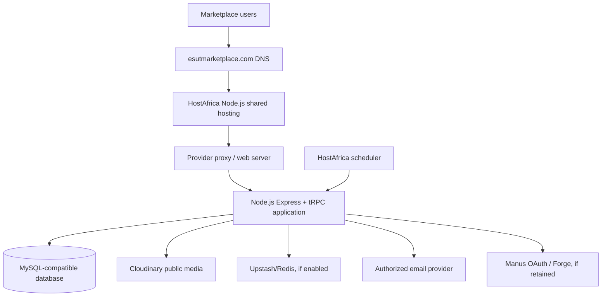

# ESUT Marketplace HostAfrica Node.js Deployment Runbook

**Application:** ESUT Marketplace  
**Production domain:** `esutmarketplace.com`  
**Hosting option:** HostAfrica Node.js Hosting shared hosting  
**Deployment style:** Staging first, then controlled production cutover  
**Prepared by:** Manus AI  
**Document status:** Complete start-to-finish implementation procedure

## 1. What this runbook accomplishes

This runbook explains how to take the current ESUT Marketplace codebase from a validated release to a working HostAfrica Node.js deployment at `esutmarketplace.com`. It covers the initial HostAfrica account setup, domain and DNS configuration, Node.js application creation, source deployment, build and startup settings, database and secrets, OAuth, Cloudinary, Redis, email, scheduled jobs, SSL, testing, cutover, monitoring, backups, and rollback.

The procedure is deliberately staging-first. The existing Manus deployment must remain available until the HostAfrica deployment has passed the full acceptance matrix. A shared Node.js plan can provide a suitable early runtime, but it does not automatically provide the same control as a VPS. Provider-controlled process limits, proxy behavior, cron support, logs, and database restrictions must therefore be confirmed before production cutover.

> The goal is not merely to make the homepage load. The deployment is successful only when buyers, sellers, administrators, authentication, sessions, media, orders, security controls, scheduled jobs, backups, and recovery all work correctly.

## 2. HostAfrica Node.js plan: what it provides and what it does not prove

The supplied HostAfrica Node.js offer states that Node.js is available on every plan, SSH is available on request, and free `.com.ng` domain and SSL are included. The supplied package details list 40 GB SSD storage, five websites, 100 email accounts, 100 subdomains, 50 MySQL databases, one FTP account, unlimited bandwidth, free Let’s Encrypt SSL, and free daily backups.

These features are helpful, but the plan description does not establish the following operational details: the supported Node.js major versions, the process manager, whether an Express process remains alive after the shell closes, memory and CPU limits, maximum process count, application-port routing, environment-variable storage, cron frequency, database connection limits, WebSocket support, log retention, restore procedure, or deployment rollback. Request written confirmation before purchase or production launch.

| Capability | Required for ESUT Marketplace | Status to confirm with HostAfrica |
|---|---|---|
| Node.js runtime | Node.js 22.x or the exact version approved by the release | Confirm available major/minor versions |
| Express process | Long-running Node.js server, not a one-off CLI process | Confirm process manager and automatic restart |
| Startup file | Current production bundle starts from `dist/index.js` | Confirm startup-file field and working directory |
| Port routing | Host panel/proxy maps the Node app to HTTPS domain traffic | Confirm application port configuration |
| Environment variables | Server-only secrets must remain private | Confirm secure environment-variable interface |
| Database | MySQL-compatible database with stable connections | Confirm version, limits, backups, and import size |
| OAuth | Secure callback and forwarded HTTPS behavior | Confirm proxy headers and custom callback URL |
| Cron | Authenticated reminder and reservation jobs | Confirm cron can send authenticated POST requests |
| External APIs | Cloudinary, Redis/Upstash, OAuth, email, and Forge if retained | Confirm outbound HTTPS and DNS access |
| Backups | Database, configuration, releases, and media metadata | Confirm retention and restoration process |
| Logs | Node, proxy, cron, error, and deployment diagnostics | Confirm access and retention |

## 3. Confirmed DirectAdmin settings and required mapping

The DirectAdmin screen currently shows the following values:

| DirectAdmin field | Current value | ESUT Marketplace decision |
|---|---|---|
| Node.js version | Node.js 22 LTS | Correct target runtime; matches the application’s current Node 22-era toolchain, subject to final provider verification |
| Application mode | Production | Correct for a production-like staging application; do not use it for the first database cutover until staging passes |
| Application root | `apps/api` | **Do not accept this unchanged for the current repository.** The repository is a single root application with `package.json`, `client/`, `server/`, `drizzle/`, and `dist/index.js` after build; it does not currently use an `apps/api` workspace directory |
| Application URL | `myapp.africa` | Temporary provider test URL only; replace with `staging.esutmarketplace.com` for staging and `esutmarketplace.com` for production after DNS is approved |

The current application’s production scripts are:

```json
"build": "vite build && esbuild server/_core/index.ts --platform=node --packages=external --bundle --format=esm --outdir=dist",
"start": "NODE_ENV=production node dist/index.js"
```

Therefore, the DirectAdmin application root must be the directory containing the full deployed repository and its `package.json`, or a deliberately prepared release directory containing the built `dist` output and the runtime files required by the bundle. Do not point DirectAdmin at a nonexistent `apps/api` directory and expect the current repository to start. Unless HostAfrica explicitly requires a different layout, use an application root such as `esut-marketplace` or `/home/USER/esut-marketplace`, set the startup file to `dist/index.js`, and run the build from that root.

If HostAfrica requires the literal root `apps/api`, there are two safe options. The preferred option is to deploy the complete repository inside that directory, so `apps/api/package.json`, `apps/api/dist/index.js`, `apps/api/client`, `apps/api/server`, and `apps/api/drizzle` exist together. The alternative is to create a reviewed deployment packaging step that copies the complete runtime into `apps/api`; do not copy only frontend files. The codebase should not be refactored into a new monorepo layout merely to match a provider field.

`myapp.africa` should not be used as the ESUT production URL unless it is an authorized domain owned by the project. Use a temporary HostAfrica URL or `staging.esutmarketplace.com` for staging. The final public URL remains `https://esutmarketplace.com`.

## 3A. Exact next DirectAdmin actions

Before changing DNS, complete the following in DirectAdmin:

1. Open the Node.js application and change the application root from `apps/api` to the full ESUT Marketplace deployment directory, unless the provider confirms that `apps/api` is an existing directory containing the complete repository.
2. Set the startup file to `dist/index.js`.
3. Confirm that the application manager uses the project root as the working directory when running `pnpm run build` and `pnpm start`.
4. Confirm whether DirectAdmin supports pnpm 10. If not, ask for the provider-approved way to install from `pnpm-lock.yaml`; do not silently replace the lockfile workflow.
5. Use `staging.esutmarketplace.com` or the temporary provider URL for the first deployment, not `esutmarketplace.com`.
6. Add the staging environment variables, including a staging database URL and `VITE_PUBLIC_SITE_URL=https://staging.esutmarketplace.com`.
7. Ask HostAfrica to confirm the Node process port/proxy mapping, automatic restart behavior, cron support, database connection limits, and secure environment-variable storage.
8. Deploy the approved commit, run `pnpm install --frozen-lockfile`, run `pnpm check`, `pnpm test`, and run `pnpm run build`.
9. Restart the DirectAdmin Node.js application and confirm the temporary URL returns the ESUT Marketplace homepage and `/api/trpc` responds with the expected application behavior.
10. Only after staging passes should the root domain, OAuth callback, Cloudinary production settings, and production database be introduced.

## 3. Target production architecture



The browser loads the React/Vite application. Browser requests to `/api/trpc` reach the Node.js/Express server. The server validates authentication and authorization, executes business procedures, reads/writes the database, and calls approved external services. Public product media is delivered through Cloudinary. Sensitive media remains protected through its configured storage boundary. The server must remain the source of truth for identity, prices, inventory, orders, permissions, security events, and moderation.

## 4. Deployment roles and access ownership

Before buying or configuring hosting, define who owns the following accounts:

| Account or asset | Required owner |
|---|---|
| HostAfrica account | ESUT-authorized organization owner |
| `esutmarketplace.com` registrar/DNS | ESUT-authorized domain owner |
| Git repository | ESUT project owner or organization account |
| Production database | ESUT technical owner |
| Cloudinary account | ESUT media owner |
| OAuth application | ESUT authentication owner |
| Redis/Upstash | ESUT infrastructure owner |
| Email sender domain | ESUT domain/email owner |
| Backup storage | Separate ESUT-controlled recovery owner |
| Administrator accounts | Named authorized administrators only |

Do not use a developer’s personal email, personal Git account, personal Cloudinary account, or personal domain as the permanent owner of production infrastructure.

## 5. Phase 0: prepare the release before purchasing or configuring

Create a release branch or approved commit. From a clean working copy, run:

```bash
pnpm install --frozen-lockfile
pnpm check
pnpm test
pnpm run build
```

The current project uses React/Vite for the frontend and bundles the Node.js server for production. The production process is started with:

```bash
NODE_ENV=production node dist/index.js
```

Before external deployment, add a single public-site configuration such as:

```text
VITE_PUBLIC_SITE_URL=https://esutmarketplace.com
```

Use this value for canonical URLs, sitemap links, robots sitemap references, absolute public links, and any email links. Replace any hard-coded `manus.space` URL used for public canonical behavior. The existing Manus URL remains useful as a rollback URL and should not be deleted during migration.

## 6. Phase 1: open and configure the HostAfrica account

Purchase the Node.js Hosting plan only after HostAfrica confirms the capability table in Section 2. Ask support to enable SSH access and provide the application deployment instructions for Node.js apps.

Record the following information in an operational register without storing secrets in the register:

| Value | Example format |
|---|---|
| HostAfrica account owner | Named ESUT owner |
| Hosting plan | Node.js Hosting package |
| Control-panel URL | Provider URL |
| SSH hostname | Provider hostname |
| SSH username | Non-root account |
| Public hosting IP | IPv4 address |
| Node.js version | Exact version |
| Application root | Provider path |
| Startup file | `dist/index.js` |
| Public hostname | `esutmarketplace.com` |
| Staging hostname | `staging.esutmarketplace.com` |
| Database host/name/user | Record names, never plaintext password |
| Backup location | Encrypted offsite destination |
| Rollback target | Current Manus version/domain |

Do not upload application files before confirming the Node.js application manager, startup file, working directory, and environment-variable interface.

## 7. Phase 2: prepare DNS and staging

Create a staging hostname first. If HostAfrica provides the same public IP for the account, create:

| Record | Name | Value |
|---|---|---|
| A | `staging` | HostAfrica hosting IP |
| A | `www` | HostAfrica hosting IP only during approved cutover |
| A | `@` | HostAfrica hosting IP only during approved cutover |

Do not change the root `@` record until staging passes. Do not add an `AAAA` record unless IPv6 is configured and tested. A broken IPv6 record can make only some users fail to connect.

Confirm DNS resolution from multiple networks:

```bash
dig +short staging.esutmarketplace.com A
dig +short esutmarketplace.com A
```

For staging, the expected result is the HostAfrica staging IP. For production, do not expect the root domain to change until the formal cutover phase.

## 8. Phase 3: create the Node.js application in the HostAfrica panel

Open the HostAfrica control panel and locate the Node.js application manager. The exact label may be “Node.js Selector,” “Application Manager,” “Node.js Apps,” or a provider-specific equivalent.

Create a staging application with these values, adapting the field names to the panel:

| Field | Value |
|---|---|
| Application mode | Production for staging runtime validation, or provider-approved staging mode |
| Node.js version | Node.js 22.x if available and supported |
| Application root | A private application directory, not a public upload directory if avoidable |
| Application URL | `staging.esutmarketplace.com` |
| Startup file | `dist/index.js` |
| Application port | Provider-assigned port or panel-managed port |
| Environment | Production-like staging variables with staging database and secrets |
| Package manager | pnpm if supported; otherwise provider-approved lockfile-compatible process |

The application root must contain the project package manifest and built `dist` directory. Do not configure the app to start only the Vite frontend, because the marketplace API and protected routes require the Node.js server.

If the panel requires an `app.js` startup filename but can run only a fixed entry file, ask HostAfrica whether the startup field can point to `dist/index.js`. Do not create an unreviewed wrapper that changes the server’s port, signal handling, or environment behavior.

## 9. Phase 4: deploy the source code

Use Git deployment if HostAfrica enables it. Deploy a pinned commit, not an unreviewed branch head. If Git is unavailable, upload a release archive through SSH/SFTP and verify its checksum.

### Git deployment

```bash
git clone YOUR_PRIVATE_REPOSITORY_URL esut-marketplace
cd esut-marketplace
git checkout APPROVED_COMMIT_SHA
```

### Install dependencies

```bash
pnpm install --frozen-lockfile
```

If HostAfrica does not support pnpm, ask support for the approved way to install from `pnpm-lock.yaml`. Do not silently convert the project to npm without a lockfile review.

### Build the application

```bash
pnpm check
pnpm test
pnpm run build
```

The build must generate the frontend assets and production server bundle. Confirm that `dist/index.js` exists and that the frontend assets are present in the expected build directory.

## 10. Phase 5: configure production and staging environment variables

Set variables through the HostAfrica Node.js application manager or protected environment interface. Do not commit `.env` files and do not place server secrets in browser-exposed `VITE_` variables.

Use separate staging and production values. The following table reflects the current server environment contract and the external services used by the application:

| Variable | Staging/production purpose |
|---|---|
| `NODE_ENV=production` | Activates production runtime behavior |
| `PORT` | Provider-assigned Node.js application port; never hard-code a public port |
| `DATABASE_URL` | MySQL/TiDB-compatible application database |
| `JWT_SECRET` | Session signing secret; rotate only with an invalidation plan |
| `VITE_APP_ID` | OAuth application identifier |
| `OAUTH_SERVER_URL` | OAuth server base URL |
| `VITE_OAUTH_PORTAL_URL` | Browser login portal URL |
| `OWNER_OPEN_ID` | Authorized project owner identity |
| `OWNER_NAME` | Owner display name |
| `BUILT_IN_FORGE_API_URL` | Required if Manus Forge/storage integration remains active |
| `BUILT_IN_FORGE_API_KEY` | Server-only Forge credential if required |
| `VITE_FRONTEND_FORGE_API_URL` | Browser-safe Forge configuration only if required |
| `VITE_FRONTEND_FORGE_API_KEY` | Only if the project’s frontend integration explicitly requires it; never place server secrets here |
| `CLOUDINARY_CLOUD_NAME` | Production Cloudinary cloud |
| `CLOUDINARY_API_KEY` | Server-side signed-upload API key |
| `CLOUDINARY_API_SECRET` | Server-side signed-upload secret |
| `REDIS_URL` | Upstash/Redis connection if enabled |
| `RESEND_API_KEY` | Email provider credential if live email is authorized |
| `RESEND_FROM_EMAIL` | Verified sender address |
| `VITE_PUBLIC_SITE_URL` | New public canonical URL: `https://esutmarketplace.com` |

The external-hosting blocker to resolve early is Forge storage. Public product media is intended for Cloudinary, but private verification evidence and certain storage-proxy paths may still depend on Manus Forge storage. Confirm that the external Node.js host can make the required outbound Forge requests and that the project owner authorizes continued use of that service. If not, complete an approved private-storage migration before cutover.

## 11. Phase 6: database setup and migration

### Preferred arrangement

Use a managed MySQL/TiDB-compatible database separate from the shared hosting account if possible. This reduces the risk that application process limits and database limits compete on the same shared platform.

### HostAfrica database arrangement

If HostAfrica supplies MySQL databases, create separate staging and production databases. Do not use the same database for both environments. Create a dedicated application user with only the required database permissions.

Confirm:

- MySQL version and compatibility with the current Drizzle schema.
- Connection limit and idle connection timeout.
- Maximum database size and import size.
- SSL/TLS support.
- Backup retention and restore workflow.
- Database host accessibility from the Node.js application.
- Charset/collation and timezone behavior.

### Migration procedure

1. Take a full backup of the current production database.
2. Generate and inspect the approved Drizzle migration.
3. Import the schema into the staging database.
4. Import approved real data only; never import fabricated sellers, products, reviews, ratings, testimonials, or test orders into production.
5. Run row-count and relationship reconciliation.
6. Run the full test suite against staging.
7. Test authentication, sessions, listing images, cart, checkout, orders, messages, reviews, moderation, and admin controls.
8. Schedule the production migration during an approved low-traffic window.
9. Take a final source database backup immediately before cutover.
10. Apply the same schema/data procedure to production.

Do not run an unreviewed destructive schema command against the production database.

## 12. Phase 7: OAuth and domain configuration

Configure the OAuth provider callback for staging:

```text
https://staging.esutmarketplace.com/api/oauth/callback
```

Configure the production callback before cutover:

```text
https://esutmarketplace.com/api/oauth/callback
```

The callback must receive `code` and `state`, validate the one-time state cookie, exchange the code server-side, create the tracked session, set the secure cookie, and redirect to `/`. Do not bypass state validation or accept arbitrary callback origins.

Behind HostAfrica’s proxy, confirm that the application receives forwarded HTTPS information. This is important for secure cookie behavior. Ask support whether the proxy forwards `X-Forwarded-Proto`, `X-Forwarded-Host`, and the client IP chain correctly.

### OAuth staging test

Use a private browser session:

1. Open `https://staging.esutmarketplace.com`.
2. Select Login.
3. Complete authentication.
4. Confirm the callback returns to `/` without a visible `?code=` parameter.
5. Open Account and Security & devices.
6. Confirm the real session appears with request-derived device metadata.
7. Log out.
8. Reopen `/account/security` and confirm the user is sent to `/login`.

## 13. Phase 8: Cloudinary public media

Configure production Cloudinary credentials only in the server environment. The application’s Cloudinary integration signs uploads and delivers optimized public media for listing cards, product detail, avatars, and approved public artwork.

Run these staging tests:

| Test | Expected behavior |
|---|---|
| Approved listing image | Upload succeeds and displays through Cloudinary |
| Product detail image | Optimized detail transformation loads |
| Missing image | Honest empty/error state, no broken infinite loading |
| Invalid file | Server rejects the file safely |
| Public avatar | Only eligible approved public avatar is exposed |
| Private evidence | Evidence remains protected and is not publicly indexed |
| Deleted media | Deleted/archived media is no longer returned publicly |
| CDN delivery | Browser receives the expected content type and cache policy |

Do not rely on HostAfrica local disk for public image source-of-truth storage. The product image path should remain Cloudinary-backed. Confirm that private evidence storage remains available from the external host or complete a separately authorized migration.

## 14. Phase 9: Redis, email, and other integrations

### Redis/Upstash

Add the production `REDIS_URL` through the protected Node.js environment configuration. Verify that the HostAfrica network allows outbound TLS connections. Test rate limiting, security-state access, session behavior, and failure handling. Never open Redis to the public internet.

### Email

Email delivery must remain disabled or clearly labeled as unavailable until the sender domain is verified and ordinary-recipient delivery is tested. If enabled, configure `RESEND_API_KEY` and `RESEND_FROM_EMAIL` only on the server. Test verification, recovery, security, seller approval, and order-related messages as applicable.

### Manus Forge

If `BUILT_IN_FORGE_API_URL` and `BUILT_IN_FORGE_API_KEY` remain required for private storage proxy or other built-in features, confirm that the external host is authorized to reach them and that the secrets can be stored server-side. Test `/manus-storage/*` behavior for both public and protected paths.

## 15. Phase 10: scheduled jobs

The application currently exposes:

```text
POST /api/scheduled/product-reminders
POST /api/scheduled/reservation-expiry
```

These endpoints are not anonymous. They authenticate the caller through the application SDK, require a cron identity and task UID, and compare the task UID with the corresponding `marketplaceSettings` database record. The reservation-expiry process can return a failure when partial processing fails.

This is a critical HostAfrica compatibility gate. A normal shared-hosting cron that simply calls `curl -X POST` may receive 403 because it will not automatically possess the managed scheduler identity. Before production use, choose one of these approved approaches:

| Approach | Use when |
|---|---|
| HostAfrica scheduler can provide the existing scheduler identity and task UID | Best option; preserve existing server contract |
| Add a dedicated authenticated VPS/shared-host cron adapter | Use only after security review; require secret, replay protection, constant-time comparison, and task-specific identity |
| External scheduler calls a protected endpoint | Use only with signed requests, timestamp validation, replay protection, and allowlisted task identifiers |
| Disable scheduled operations | Not acceptable for production if reminders or reservation expiry are business-critical |

Do not make either endpoint public. Test invalid credentials, wrong task UID, duplicate execution, timeout, partial failure, and successful execution in staging.

## 16. Phase 11: SSL and HTTPS

HostAfrica states that free Let’s Encrypt SSL is included. Ask support whether certificates are automatically provisioned and renewed for the root domain, `www`, and staging subdomain. If the control panel requires manual activation, enable SSL after DNS points to HostAfrica.

Verify:

```bash
curl -I http://staging.esutmarketplace.com
curl -I https://staging.esutmarketplace.com
```

Expected behavior is HTTP-to-HTTPS redirection and a valid certificate. Confirm that:

- OAuth callback is HTTPS.
- Session cookies are secure.
- No mixed-content warning appears.
- API and storage requests use HTTPS.
- The host does not place a shared cache in front of authenticated responses.

## 17. Phase 12: public routing and static assets

The application uses a React SPA with server-side static delivery and route fallback. The provider must serve built assets correctly and route non-asset paths to the application shell. Missing hashed `/assets/*` files must return a non-HTML 404, not `index.html` with HTTP 200; otherwise stale deployment manifests produce dynamic-import failures.

Test:

```bash
curl -i https://staging.esutmarketplace.com/assets/does-not-exist.js
curl -i https://staging.esutmarketplace.com/
curl -i https://staging.esutmarketplace.com/explore
```

The missing asset must not return JavaScript or HTML with status 200. The homepage and SPA routes must return the expected application shell.

## 18. Phase 13: complete staging acceptance test

Do not change the production domain until the following table passes:

| Area | Required test |
|---|---|
| Public discovery | Homepage, Explore, category filters, search, sorting, no-results state |
| Product/store | Known listing, unknown listing, known store, unknown store |
| Authentication | Registration, login, OAuth, logout, password boundary, session refresh |
| Buyer | Account, orders, favorites, messages, notifications, Security & devices |
| Seller | Application, verification, store, listing create/edit, inventory, orders, offers |
| Admin | Control center, users, sellers, stores, moderation, reports, disputes, audit |
| Checkout | Cart, stock validation, reservation, order creation, pickup information |
| Reviews | Completed-purchase eligibility, verified display, sorting, mobile layout |
| Media | Cloudinary public images, protected evidence, broken/missing media state |
| Scheduled jobs | Reminders and reservation expiry with valid and invalid scheduler credentials |
| Security | HTTPS, headers, noindex, route redirects, protected APIs, no secret leakage |
| Responsive | 320px, 360px, 375px, 390px, tablet, and desktop route matrix |
| Failure recovery | Database unavailable, API HTML response, missing asset, expired session, provider timeout |

Run the existing project validation before upload and again after staging integration:

```bash
pnpm check
pnpm test
pnpm run build
```

## 19. Phase 14: production cutover to `esutmarketplace.com`

Perform cutover in a planned low-traffic window.

### Pre-cutover

Take a final production database backup. Record the current Manus version and URL. Confirm staging is healthy. Confirm HostAfrica has the final production environment variables. Confirm OAuth production callback settings. Confirm Cloudinary, Redis, email, and scheduler settings. Confirm the rollback path.

### Cutover sequence

1. Set `VITE_PUBLIC_SITE_URL=https://esutmarketplace.com` in the production build environment.
2. Change robots and sitemap absolute URLs to `https://esutmarketplace.com`.
3. Configure `https://esutmarketplace.com/api/oauth/callback` in the OAuth provider.
4. Create or confirm the HostAfrica application URL for `esutmarketplace.com`.
5. Point the domain’s DNS `A` record to HostAfrica.
6. Point `www` to the approved HostAfrica destination or redirect it to the root domain.
7. Wait for DNS resolution and enable/verify Let’s Encrypt SSL.
8. Open the production homepage over HTTPS.
9. Run the smoke-test matrix.
10. Test one real buyer account, one real seller account, and one authorized admin account.
11. Confirm product images, Security & devices, cart/checkout, messages, and schedules.
12. Keep the current Manus URL available as a rollback path.

### Production smoke test

```bash
curl -I https://esutmarketplace.com/
curl -I https://esutmarketplace.com/robots.txt
curl -I https://esutmarketplace.com/sitemap.xml
```

Then test authenticated routes in a private browser session. Confirm that signed-out users are redirected correctly: `/account` and `/checkout` to `/login`, and `/admin`, `/seller`, and `/moderator` according to the current protected-route policy.

## 20. Monitoring after launch

For the first 24–72 hours, monitor the HostAfrica application logs, control-panel resource graphs, database errors, DNS, SSL, image delivery, OAuth errors, cron results, and user reports.

| Signal | Response |
|---|---|
| Node process stops | Restart through the HostAfrica panel and inspect crash logs |
| Memory/process limit | Reduce build/runtime pressure or upgrade plan; do not hide the symptom with retries |
| HTTP 5xx | Inspect Node logs, database, Cloudinary, Redis, and provider proxy |
| Missing asset 404 | Compare deployed HTML and assets from the same release |
| OAuth failure | Verify callback URL, secure cookie, proxy HTTPS headers, and provider allow-list |
| Database error | Check credentials, version, limits, connection count, and provider status |
| Cron 403 | Verify scheduler identity and task UID; do not make endpoint public |
| Image failure | Verify Cloudinary credentials, outbound HTTPS, public ID, and media status |
| Disk/quota issue | Remove old staging/release artifacts safely and request provider limits |

## 21. Backups and restoration

HostAfrica advertises free daily backups, but the project must not rely on provider backups alone. Confirm retention, restore scope, restore time, and whether the backup includes database contents, application files, environment settings, and email data.

Maintain an independent backup strategy:

| Backup | Minimum procedure |
|---|---|
| Database | Daily encrypted logical backup or managed database backup with multiple generations |
| Source/release | Git commit/tag and build identifier for every release |
| Configuration | Protected record of variable names, callback URLs, DNS, scheduler IDs, and provider settings; never store plaintext secrets in the document |
| Media metadata | Database backup containing Cloudinary IDs, URLs, status, ownership, and lifecycle fields |
| Critical public artwork | Cloudinary retention/export policy where available |
| Audit/security data | Preserve security events, moderation, and audit records |

Test restoration into staging before relying on the backup. A backup that has never been restored is not a proven recovery method.

## 22. Rollback procedure

### Application rollback

Use the HostAfrica panel’s previous deployment or redeploy the previous approved Git commit. Do not overwrite production with an unreviewed working tree.

### Database rollback

If only application code changed and the schema is compatible, return to the previous application release. If the schema changed incompatibly, restore the approved database backup and the matching application version. Never mix a new schema with an old application without compatibility verification.

### Domain rollback

If HostAfrica cannot serve the application reliably, restore the DNS record or proxy target to the current Manus deployment. Keep the HostAfrica environment intact for investigation. Do not delete the old deployment, database, or logs until the incident is understood.

### Security rollback

If a secret is exposed, rotate it, invalidate affected sessions, inspect audit logs, and redeploy. Do not solve a security incident by weakening cookie, OAuth, authorization, or route-protection settings.

## 23. Final go-live decision

The HostAfrica Node.js plan is suitable for an initial deployment only when the provider confirms the runtime contract and the application passes staging. The most important unresolved gate is scheduled-job authentication, followed by secure environment variables, compatible database access, forwarded HTTPS behavior, and private Forge storage compatibility.

The final recommendation is:

> Use HostAfrica Node.js Hosting as a controlled staging and early-production option only after written capability confirmation. Keep the current Manus deployment as rollback. If HostAfrica’s shared process, cron, database, or private-storage limitations prevent the acceptance matrix from passing, move the production workload to a VPS rather than weakening the application’s security or business controls.

## 24. References

[1]: https://www.hostafrica.ng/hosting/node-js-hosting/ — HostAfrica Node.js Hosting product page.  
[2]: https://www.hostafrica.ng/hosting/web-hosting/ — HostAfrica general Web Hosting and backup/Git/SSL information.  
[3]: https://ubuntu.com/server/docs/ — Ubuntu Server administration, security, SSH, firewall, software, DNS, and service documentation.  
[4]: https://docs.nginx.com/nginx/admin-guide/web-server/reverse-proxy/ — Official NGINX reverse-proxy documentation.  
[5]: https://certbot.eff.org/instructions?ws=nginx&os=ubuntufocal — Certbot NGINX HTTPS and renewal instructions.  
[6]: `package.json` — Current ESUT Marketplace scripts for install, validation, test, build, start, and migration.  
[7]: `server/_core/env.ts` — Current server environment-variable contract.  
[8]: `server/_core/oauth.ts` — Current OAuth callback, state validation, session creation, secure cookie, and redirect behavior.  
[9]: `server/cloudinary.ts` — Current Cloudinary signed-upload and public-media transformation behavior.  
[10]: `server/productReminderSchedule.ts` and `server/reservationExpirySchedule.ts` — Current authenticated scheduled-job contracts.  
[11]: `server/_core/storageProxy.ts` — Current protected/private storage proxy behavior.  
[12]: `server/_core/securityHeaders.ts` — Current security headers, HSTS, and crawler protection.  
[13]: `server/_core/vite.ts` — Current static asset, SPA fallback, and missing hashed-asset behavior.

> This runbook is an engineering and deployment document. It is not legal, privacy, tax, university-policy, consumer-protection, or hosting-contract advice. The ESUT project owner and qualified technical/security reviewers must approve the final production cutover.
