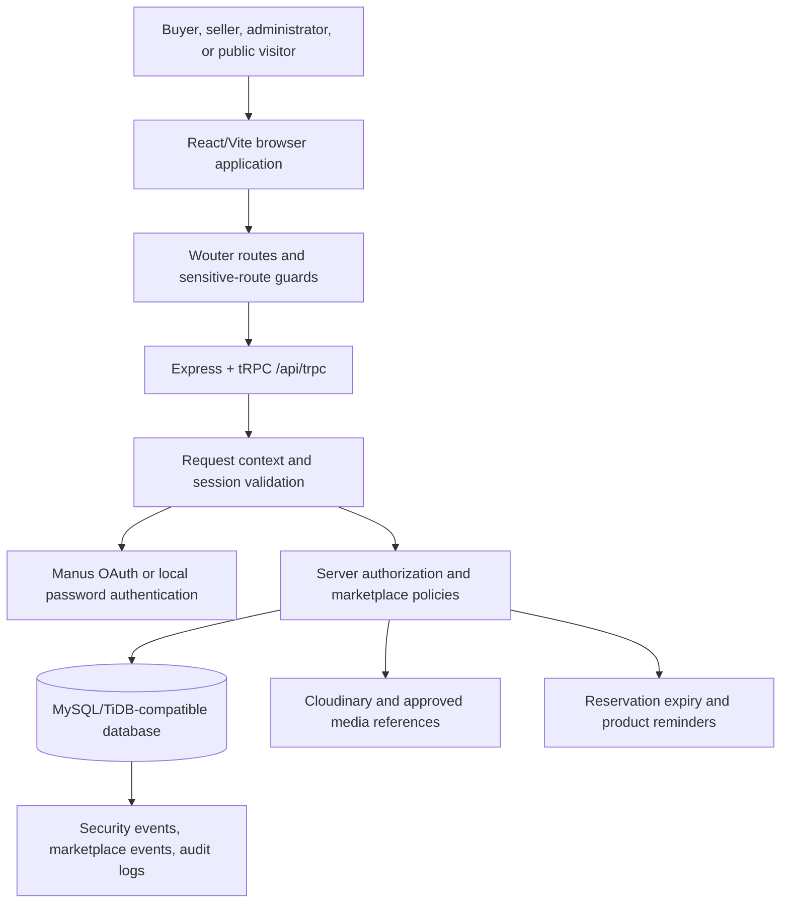

# ESUT Marketplace Hosting Runbook

**Document status:** Production hosting and operations procedure  
**Application:** ESUT Marketplace  
**Current public deployment:** `https://esutshop-59wzg8bs.manus.space`  
**Prepared by:** Manus AI  
**Audience:** ESUT project owner, technical administrator, hosting operator, database administrator, and security reviewer.

## 1. Purpose and operating principle

This runbook explains how to host, configure, release, verify, secure, monitor, back up, and recover ESUT Marketplace. It covers the current **Manus WebDev deployment**, which is the recommended production path, and a controlled **external cPanel/Node.js migration path** for a provider that explicitly supports Node.js applications.

ESUT Marketplace is not a static brochure website. It is a React 19 application with an Express server, tRPC API, Drizzle ORM, MySQL/TiDB-oriented persistence, authentication, seller and administrator workspaces, Cloudinary media, session security, marketplace scheduling, messaging, orders, inventory reservations, and moderation controls. Hosting must therefore provide a reliable application process, a compatible database, secure environment variables, HTTPS, scheduled-job execution, outbound HTTPS, logs, backups, and rollback capability.

> Never move the live domain first. Build and validate a staging deployment, keep the existing deployment available as a rollback target, and perform cutover only after the acceptance gates in this document pass.

## 2. Deployment decision

### Recommended choice: Manus WebDev

Manus is the preferred deployment path for the current codebase because the project is already scaffolded and operated as a Manus WebDev full-stack application. The managed path supplies the project runtime, deployment/checkpoint workflow, HTTPS, environment-secret management, database integration, preview, rollback, and scheduled-job integration without requiring a manual process manager or reverse proxy.

The current public domain is `esutshop-59wzg8bs.manus.space`. A custom domain, Vercel migration, PostgreSQL migration, external email sender, or other infrastructure change is a separate authorization decision and must not be inferred from this runbook.

### Alternative choice: external cPanel/Node.js hosting

A cPanel plan can host ESUT Marketplace only if the provider supports a continuously running Node.js application through cPanel Application Manager, Passenger, or an equivalent process manager. “Node.js support” on a price page is not sufficient proof. The provider must confirm the supported Node version, memory and CPU limits, process restart behavior, environment variables, database access, cron, outbound TLS, long-running request limits, WebSocket or polling behavior, logs, backups, and restore procedures.

External hosting creates an operational migration. It is not equivalent to uploading a Vite folder. The Express server must run, the database must be migrated or connected, OAuth callbacks must be changed, cookies must remain secure, scheduled endpoints must be invoked, Cloudinary and other outbound services must remain reachable, and a rollback path must be preserved.

## 3. Current architecture and request flow



The frontend is built by Vite. The backend is bundled by esbuild from `server/_core/index.ts`. Express registers security headers, storage proxy routes, OAuth, tRPC, scheduled endpoints, API fallback protection, and either the Vite development middleware or production static delivery. The production start command is `NODE_ENV=production node dist/index.js`.[1] [2]

The OAuth callback is exactly `/api/oauth/callback`. It validates the authorization `code` and `state`, checks the one-time OAuth state cookie, exchanges the code, creates or updates the user, creates a tracked session using request metadata, sets the session cookie, and redirects to `/`.[3]

## 4. Hosting prerequisites

Before deployment, the owner should identify the production owner, recovery contact, technical operator, database owner, media owner, sender-domain owner, and person authorized to approve releases. Store this information outside the application as part of the organization’s operational record.

| Requirement | Manus WebDev | External cPanel/Node.js |
|---|---|---|
| Source repository | Connected project/repository | Git access or uploaded release archive |
| Runtime | Managed Node.js/Express runtime | Node.js version and Passenger/Application Manager confirmed in writing |
| Database | Managed project database | MySQL-compatible database, credentials, import/restore access, connection limits |
| HTTPS | Managed deployment TLS | Provider SSL plus valid proxy/origin configuration |
| Secrets | Project secret manager | cPanel environment variables or protected server configuration; never commit `.env` |
| Public media | Cloudinary and/or configured storage | Outbound HTTPS and Cloudinary credentials; local disk must not become the media source of truth |
| OAuth | Existing Manus OAuth configuration | Callback and allowed-origin update required for every hostname |
| Scheduled jobs | Managed schedule integration | Authenticated cron requests to the two schedule endpoints |
| Backups | Project/provider backup process | Database, media metadata, configuration, and release backup with tested restore |
| Rollback | Checkpoint/version rollback | Previous release directory, database compatibility, and DNS rollback |

### Provider questions that must be answered before external hosting

Ask the provider for written answers to the following questions:

| Area | Required confirmation |
|---|---|
| Node.js | Supported versions, process manager, startup command, restart behavior, memory limit, CPU limit, process count, and deployment method |
| Reverse proxy | Whether `X-Forwarded-Proto` and `X-Forwarded-Host` are passed correctly, and whether WebSocket or long-polling connections are supported |
| Database | MySQL version, connection limits, maximum import size, backups, point-in-time recovery, charset/collation, and remote connection policy |
| Cron | Minimum interval, HTTPS support, custom headers, execution timeout, failure logs, and whether cron can call authenticated POST endpoints |
| Files | Whether application files are ephemeral or persistent, and where build artifacts and logs are stored |
| Secrets | Secure environment variables, visibility, rotation, and whether secrets are exposed to client builds |
| Email | SMTP/API connectivity, outbound TLS, sender-domain requirements, and rate limits |
| Backups | Retention, restore method, separate storage, restore time, and whether a full account restore is available |
| Support | Incident response, uptime definition, resource-throttling policy, and suspension/fair-use rules |

## 5. Source and release preparation

Use a clean working copy of the repository. Do not deploy uncommitted local experiments, generated test data, debug credentials, or uploaded secrets.

Run the following checks locally or in the managed development environment:

```bash
pnpm install --frozen-lockfile
pnpm check
pnpm test
pnpm run build
```

The repository scripts currently define the following release commands:

| Command | Purpose |
|---|---|
| `pnpm dev` | Development server using `tsx watch` and the Express entry point |
| `pnpm check` | TypeScript validation without emitting files |
| `pnpm test` | Full Vitest suite |
| `pnpm run build` | Vite frontend build followed by esbuild server bundle |
| `pnpm start` | Production process using `dist/index.js` |
| `pnpm run build:frontend` | Frontend-only build, primarily for the Cloudflare staging path |
| `pnpm run deploy:cloudflare:staging` | Builds and deploys the frontend to the configured Cloudflare Pages staging project |
| `pnpm db:push` | Generates and applies Drizzle migrations; use only under the approved migration procedure |

For the current Manus project, database schema changes must follow the project’s schema-first process: update `drizzle/schema.ts`, generate and inspect the migration, apply the approved SQL through the project database migration workflow, verify the result, and retain the existing database as the source of truth. Do not run destructive schema commands against production without an approved backup and rollback plan.

## 6. Environment configuration

The server reads the following environment values through `server/_core/env.ts`.[4] Values marked secret must be placed in the hosting provider’s secret manager or protected server environment, never in Git, frontend source, screenshots, or support tickets.

| Variable | Required? | Scope | Purpose |
|---|---|---|---|
| `NODE_ENV` | Yes | Server | Use `production` for production start |
| `PORT` | Yes where required | Server | Hosting-provided listening port; the code must use the provider value rather than hard-coding a port |
| `DATABASE_URL` | Yes | Server secret | MySQL/TiDB-compatible database connection string |
| `JWT_SECRET` | Yes | Server secret | Session-cookie signing/validation secret; use a high-entropy value and rotate only with a session invalidation plan |
| `VITE_APP_ID` | Yes | Public build/runtime configuration | Manus OAuth application identifier |
| `OAUTH_SERVER_URL` | Yes | Server | OAuth server base URL |
| `VITE_OAUTH_PORTAL_URL` | Yes | Frontend build | Login portal URL used by the browser |
| `OWNER_OPEN_ID` | Yes for owner controls | Server | Owner identity used by project control logic |
| `OWNER_NAME` | Recommended | Server | Owner display identity |
| `BUILT_IN_FORGE_API_URL` | Yes for Manus storage/Forge features | Server secret/config | Manus built-in API endpoint |
| `BUILT_IN_FORGE_API_KEY` | Yes for server Forge calls | Server secret | Server-side Forge authorization |
| `VITE_FRONTEND_FORGE_API_URL` | If frontend Forge features are used | Frontend build | Browser-safe Forge endpoint configuration |
| `VITE_FRONTEND_FORGE_API_KEY` | If frontend Forge features are used | Frontend build | Only use as designed by the template; do not place server secrets here |
| `RESEND_API_KEY` | Optional until live email is authorized | Server secret | Resend API access for email delivery |
| `RESEND_FROM_EMAIL` | Optional until sender domain is verified | Server config | Verified sender address |
| `CLOUDINARY_CLOUD_NAME` | Required for Cloudinary media | Server config | Cloudinary cloud identifier |
| `CLOUDINARY_API_KEY` | Required for server-signed uploads | Server secret | Cloudinary API key |
| `CLOUDINARY_API_SECRET` | Required for server-signed uploads | Server secret | Cloudinary signing secret |
| `REDIS_URL` | If Redis-backed state is enabled | Server secret | Upstash/Redis connection URL |
| `VITE_APP_TITLE` | Optional | Frontend build | Site title managed by the hosting project |
| `VITE_APP_LOGO` | Optional | Frontend build | Site logo configuration managed by the hosting project |

### Secret-handling rules

Use separate values for development, staging, and production. Never copy a production database URL or JWT secret into a developer machine unless explicitly authorized. Rotate credentials after staff changes, suspected disclosure, or provider migration. After rotation, test login, logout, OAuth, Cloudinary uploads, Redis access, and scheduled jobs.

## 7. Database preparation

The current schema is MySQL/TiDB-oriented and includes identity, authentication, sessions, security events, profiles, seller applications, stores, verification requests, categories, listings, listing images, media assets, inventory, carts, orders, reservations, pickup coordination, offers, conversations, messages, notifications, search alerts, reminders, moderation, audit, and operational records.[5]

Before a production deployment:

1. Create or select the production database.
2. Create a least-privilege application database user with only the permissions required by the application and approved migrations.
3. Confirm timezone, UTF-8/Unicode configuration, collation, connection limits, maximum packet size, and SSL/TLS policy.
4. Take a full database backup and record its timestamp, storage location, checksum if available, and restoration procedure.
5. Apply schema migrations in dependency order.
6. Verify the expected tables, indexes, enum values, and essential settings.
7. Run read-only integrity checks for users, active stores, active listings, listing images, inventory, orders, sessions, and audit records.
8. Never seed fake sellers, fake products, fake orders, fake reviews, or fake testimonials into production.

For an external cPanel migration, export and import the database using the provider’s approved method. Validate row counts and critical relationships before pointing the application at the new database. Do not delete the old database until the new deployment has passed the reconciliation and rollback period.

## 8. Public media and storage setup

Public product images, transformed thumbnails, approved artwork, logo assets, and eligible public avatars are designed to use Cloudinary. The integration signs uploads server-side and returns optimized delivery URLs using automatic format/quality and bounded-width transformations.[6]

Complete the following media setup:

| Step | Procedure |
|---|---|
| 1 | Create or select the Cloudinary production cloud and record the cloud name, API key, and API secret in the host secret manager |
| 2 | Restrict upload and transformation settings to the approved project policy |
| 3 | Confirm outbound HTTPS from the application server to Cloudinary |
| 4 | Upload one test product image in staging and verify the normalized public ID, optimized URL, dimensions, MIME type, and media status |
| 5 | Verify the listing card, product detail, avatar, and public-artwork transformation profiles |
| 6 | Confirm only approved public assets appear in public listing/store responses |
| 7 | Confirm verification evidence and unapproved listing video evidence remain protected through the storage proxy |
| 8 | Test failed upload, oversized file, invalid MIME type, rejected media, archived media, and missing-media states |

The Manus storage proxy uses `/manus-storage/*` for configured storage references. Verification evidence is restricted to administrators, while unapproved listing-video evidence is restricted to the owner or administrator. A non-Manus host must either retain a compatible storage/proxy service or complete an authorized media migration before disabling the existing path.[7]

## 9. Authentication and OAuth configuration

The production OAuth application must allow the exact callback URL:

```text
https://YOUR_PUBLIC_HOST/api/oauth/callback
```

For the current deployment:

```text
https://esutshop-59wzg8bs.manus.space/api/oauth/callback
```

For a new staging hostname, use a separate callback configuration or an explicitly approved additional callback. Do not casually reuse production callbacks across unrelated environments.

The OAuth callback requires both `code` and `state`, validates the state nonce against a one-time cookie, exchanges the code server-side, creates the tracked session, sets the session cookie, and redirects to `/`.[3] Behind a reverse proxy, ensure the application receives the correct forwarded HTTPS information. The application uses request security and forwarded protocol data when choosing secure cookie behavior and HSTS.

### OAuth acceptance test

Perform this test in a clean browser session:

1. Open the public host and choose Login.
2. Complete the provider login.
3. Confirm the browser returns to `/`, not to a visible `?code=` URL.
4. Confirm the user appears authenticated.
5. Open Account and Security & devices.
6. Confirm a real current session exists with request-derived device metadata.
7. Log out and confirm the session is no longer usable.
8. Attempt to open `/account/security` while signed out and confirm the route redirects to `/login`.

## 10. Manus WebDev deployment procedure

### 10.1 Pre-release gate

Confirm that the repository is clean, the correct branch/version is selected, all required secrets exist in the project secret manager, the database is available, Cloudinary is configured, OAuth callback settings match the hostname, and no infrastructure track has been changed without explicit authorization.

Run:

```bash
pnpm check
pnpm test
pnpm run build
```

Then verify public homepage, Explore, product detail, store detail, login, buyer account, seller workspace, admin control center, Security & devices, checkout, messages, and public utility routes in the managed preview.

### 10.2 Publish through a checkpoint

Save a project checkpoint after validation. The checkpoint is the release artifact and rollback point. Do not publish a broken or untested working tree. After publication, use the current public domain and verify that the new deployment is serving the current asset manifest.

### 10.3 Production smoke test

| Test | Expected result |
|---|---|
| `/` | Homepage renders with current hero and public content |
| `/explore` | Real listing query loads; loading, empty, and error states work |
| `/product/{known-slug}` | Product loads with real details and approved media |
| `/product/{unknown-slug}` | Helpful not-found state, not blank success |
| `/store/{known-slug}` | Store loads once with active listings |
| `/store/{unknown-slug}` | Helpful not-found/error state without indefinite loading |
| `/robots.txt` | Only truthful global crawler rule and sitemap reference |
| `/sitemap.xml` | Only intentional public routes are enumerated |
| `/admin` while signed out | Redirects to `/` |
| `/account` while signed out | Redirects to `/login` |
| `/checkout` while signed out | Redirects to `/login` |
| OAuth callback | Exchanges code and redirects cleanly to `/` |
| `/assets/missing.js` | Plain 404, not HTML with status 200 |

### 10.4 Rollback on Manus

If a release causes an error, dynamic-import failure, blank admin workspace, broken OAuth, or failed database contract, stop further changes and roll back to the last known-good checkpoint. Preserve logs and the failing URL. Do not use destructive Git reset commands as a recovery procedure. After rollback, verify homepage, login, account security, seller, admin, and product routes again.

## 11. External cPanel/Node.js deployment procedure

This path is provider-dependent. The exact cPanel labels may differ, but the sequence must remain the same.

### 11.1 Create a staging application

Create a temporary hostname such as `staging.example.com`. Do not change the current production domain. Create a Node.js application through cPanel Application Manager or Passenger. Set the application root to a directory outside the public web root when possible. Configure the provider-supplied port or socket; do not hard-code a public port.

The application start command must ultimately execute:

```bash
NODE_ENV=production node dist/index.js
```

The build must be performed in a controlled release directory:

```bash
pnpm install --frozen-lockfile
pnpm run build
```

If the provider does not support pnpm, install dependencies with a provider-approved equivalent only after confirming lockfile compatibility. Do not silently mix package managers across releases.

### 11.2 Configure the reverse proxy

The provider’s proxy must forward HTTPS and host information correctly. Confirm that the application receives `X-Forwarded-Proto: https` on secure requests. Confirm that `/api/oauth/callback`, `/api/trpc`, `/manus-storage/*`, `/assets/*`, and SPA routes reach the correct backend/static handlers.

The routing order must preserve these boundaries:

1. Security headers.
2. Storage proxy.
3. OAuth callback.
4. No-cache API/OAuth response middleware.
5. tRPC API.
6. Scheduled endpoints.
7. API fallback protection.
8. Vite development middleware or production static delivery.

Do not configure the reverse proxy to send missing JavaScript assets to `index.html`. Missing `/assets/*` requests must return a non-HTML 404, otherwise stale deployment manifests create `Failed to fetch dynamically imported module` errors.

### 11.3 Configure database and environment variables

Create the production database and least-privilege user. Add the environment variables from Section 6 in cPanel’s protected environment configuration. Do not put `DATABASE_URL`, `JWT_SECRET`, `CLOUDINARY_API_SECRET`, `RESEND_API_KEY`, or Forge keys in frontend variables or committed files.

Restart the Node.js application after changing variables. Confirm the process log shows successful startup and no missing required configuration errors.

### 11.4 Configure cron jobs

Two scheduled endpoints exist:

```text
POST /api/scheduled/product-reminders
POST /api/scheduled/reservation-expiry
```

They are not public anonymous endpoints. The scheduler must authenticate with the expected cron identity and task UID, and the database setting must match the registered task. Configure the provider’s cron to call the endpoint over HTTPS using the required authentication method. Confirm the cron interval and timeout with the provider.

At minimum, test each job manually in staging, confirm successful logs, confirm idempotent behavior, and verify that an invalid or missing cron identity is rejected. Never expose an unauthenticated public endpoint that can trigger reminders or reservation expiry.

### 11.5 Configure the domain and SSL

After staging passes, create the production DNS records only when the owner authorizes cutover. Keep the Manus domain as a rollback URL. Enable provider SSL, force HTTPS, and verify the following URLs:

```text
https://YOUR_DOMAIN/
https://YOUR_DOMAIN/api/oauth/callback
https://YOUR_DOMAIN/robots.txt
https://YOUR_DOMAIN/sitemap.xml
```

Update the OAuth provider callback and allowed origins. Update the application’s canonical URL configuration if required. Update the sitemap and robots references if the public domain changes. Verify that cookies are secure and that no mixed-content request appears.

### 11.6 cPanel cutover acceptance gate

Do not cut over until all of the following pass:

| Gate | Required evidence |
|---|---|
| Build | Clean `pnpm run build` output |
| Runtime | Node process stays alive after restart and provider maintenance simulation |
| Database | Migration verification, row-count comparison, and backup restore test |
| Auth | OAuth, local login, logout, password recovery boundary, and session revocation |
| Roles | Buyer, seller, moderator, admin, and unauthorized route behavior |
| Marketplace | Explore, product, store, cart, checkout, order, pickup, offer, and review flows |
| Media | Cloudinary upload/delivery and protected evidence behavior |
| Schedules | Both cron endpoints authenticate, run, log, and fail safely |
| Security | HTTPS, headers, cookies, CSP, noindex, rate limits, and no secret leakage |
| Recovery | Previous deployment and database restore are available and tested |

## 12. Security hardening checklist

The server currently applies content-type sniffing protection, strict referrer policy, restrictive permissions policy, frame denial, Content Security Policy, and HSTS when the request is secure or forwarded as HTTPS.[8] Preserve these headers after migration.

Sensitive application routes should not be advertised to crawlers. `robots.txt` is a discovery policy, not an access-control mechanism. The HTTP layer also uses `X-Robots-Tag: noindex, nofollow, noarchive` for account, checkout, admin, moderator, and seller route families. Keep server-side authorization active even if a route is removed from a sitemap.[8]

Use least privilege for database users, hosting staff, Cloudinary keys, email keys, Redis credentials, and OAuth configuration. Restrict administrator accounts, use strong unique passwords, review Security & devices, revoke unknown sessions, and preserve audit logs. Do not expose verification evidence, private media, session hashes, or internal security metadata in public responses.

Protect deployment artifacts and logs. Dynamic JavaScript assets should be served with immutable caching, while `index.html` should be revalidated so new deployments do not retain old chunk hashes. API and OAuth responses must not be cached by browsers or shared proxies.

## 13. Backup and restoration procedure

A real production backup plan must cover more than the application source code. It must cover the database, media metadata, Cloudinary asset references, hosting configuration, environment-variable inventory without secret values, OAuth configuration, scheduled-job configuration, and the previous release artifact.

| Backup object | Minimum procedure | Restore verification |
|---|---|---|
| Database | Daily full backup plus provider-supported incremental/point-in-time option | Restore into isolated database and run integrity checks |
| Source/release | Git commit and hosting checkpoint/release artifact | Rebuild and compare application version |
| Media metadata | Database backup including `mediaAssets`, `listingImages`, and storage references | Verify known listing images and public/private status |
| Cloudinary media | Provider retention/versioning or documented asset export for critical artwork | Restore/reference test asset and verify delivery URLs |
| Configuration | Record variable names, callback URLs, domains, cron task IDs, and provider settings without secret values | Reconstruct staging configuration from the record |
| Audit/security | Preserve audit logs, security events, and moderation history | Query restored records and confirm actor attribution |

Perform a restoration drill before any production cutover. A backup that has never been restored is an assumption, not a recovery system.

## 14. Monitoring and incident response

Monitor availability, HTTP 5xx responses, authentication failures, tRPC error rates, database connection errors, Cloudinary failures, storage-proxy failures, cron failures, missing asset 404s, reservation expiry failures, and unusual administrator/security activity.

When an incident occurs, record the start time, affected hostname, release version, user-visible symptom, failing route, relevant request status, logs, and actions taken. First protect data and users: pause risky changes, preserve evidence, disable an affected feature only if necessary, and avoid destructive cleanup. Then roll back to the last known-good release, verify the critical smoke-test routes, and communicate the result. After service recovery, document root cause, preventive test coverage, and whether a schema or provider change is required.

## 15. Release procedure

A normal release follows this sequence:

1. Define the change and its acceptance criteria.
2. Update the project TODO/history and source code.
3. Run focused tests for the changed behavior.
4. Run `pnpm check`.
5. Run `pnpm test`.
6. Run `pnpm run build`.
7. Verify public and protected routes in preview.
8. Test the required narrow-mobile widths, especially 320–390px.
9. Review logs for runtime, network, browser, and API errors.
10. Save a checkpoint with a descriptive message.
11. Publish or deploy through the approved hosting path.
12. Run the production smoke test.
13. Keep the previous checkpoint/release available until acceptance is complete.

Do not combine unrelated database, hosting, DNS, email, and authentication migrations into one uncontrolled release.

## 16. Migration rollback procedure

If external hosting fails after DNS cutover, restore the previous DNS target or provider route, keep the old deployment active, and do not delete the new database until reconciliation is complete. If only the application release is faulty, revert the application release while preserving the database if schema compatibility remains safe. If the schema has changed incompatibly, restore the previous application and database pair rather than mixing versions.

After rollback, test authentication, account Security & devices, seller workspace, admin control center, product/store pages, Cloudinary media, cart/checkout, and public robots/sitemap. Record the reason for rollback and freeze the failed release until the cause is understood.

## 17. Operational ownership checklist

The owner should maintain a simple operations register containing the current public URL, hosting provider, deployment version, database provider, media provider, sender-domain status, OAuth callback URLs, cron task IDs, backup location, last restore test, current rollback version, administrator list, and deferred infrastructure decisions.

The marketplace administrator should review pending seller applications, verification requests, listing moderation, reports, disputes, suspicious security activity, failed pickup exceptions, and audit events. The technical operator should review release health, database health, scheduled-job results, storage/media failures, and backup status. The business owner should approve category policy, seller eligibility, pickup policy, dispute rules, retention policy, and infrastructure cutovers.

## 18. Final go-live checklist

Before calling a deployment production-ready, obtain affirmative evidence for each item in this table.

| Area | Go-live condition |
|---|---|
| Application | Production build completes and starts with the provider’s command |
| Database | Schema matches code, backup exists, restore has been tested |
| Secrets | Required server secrets exist, frontend does not contain server secrets |
| Authentication | OAuth callback, local login, logout, reset boundary, secure cookies, and session revocation work |
| Authorization | Buyer, seller, moderator, administrator, and unauthenticated route behavior is correct |
| Marketplace | Discovery, product/store, cart, checkout, inventory, pickup, messaging, offers, and reviews work |
| Media | Approved Cloudinary images deliver; private evidence remains protected |
| Schedules | Reminders and reservation expiry run through authenticated cron |
| Security | HTTPS, headers, CSP, HSTS, noindex, rate limits, and audit records are present |
| Mobile | 320, 360, 375, and 390px routes do not clip or overflow; tablet/desktop remain intact |
| Operations | Logs, alert contact, backup, restore, rollback, and incident procedure are known |
| Governance | Owner has approved the domain, sender email, payment method, data policy, and hosting cutover |

## References

[1]: `package.json` — build, start, test, type-check, migration, and staging deployment scripts.  
[2]: `server/_core/index.ts` — Express middleware order, OAuth, tRPC, scheduled endpoints, API fallback, and static delivery.  
[3]: `server/_core/oauth.ts` — OAuth callback validation, token exchange, tracked session creation, cookie setting, and redirect behavior.  
[4]: `server/_core/env.ts` — server environment-variable contract.  
[5]: `drizzle/schema.ts` — database tables, roles, statuses, media, commerce, security, and audit entities.  
[6]: `server/cloudinary.ts` — signed public-image uploads, approved media identifiers, and optimized transformation URLs.  
[7]: `server/_core/storageProxy.ts` — public/protected Manus storage proxy behavior and cache headers.  
[8]: `server/_core/securityHeaders.ts` — browser security headers, HSTS, and route-aware crawler protection.  
[9]: `server/productReminderSchedule.ts` — authenticated product-reminder scheduled endpoint.  
[10]: `server/reservationExpirySchedule.ts` — authenticated reservation-expiry scheduled endpoint.  
[11]: `server/_core/vite.ts` — development middleware, production static assets, missing-asset 404 boundary, and SPA-shell cache policy.

> This runbook is an engineering and operations document. It does not constitute legal, tax, privacy, consumer-protection, institutional, or hosting-provider advice. ESUT-authorized owners and qualified advisers must approve the platform’s policies and infrastructure decisions.
